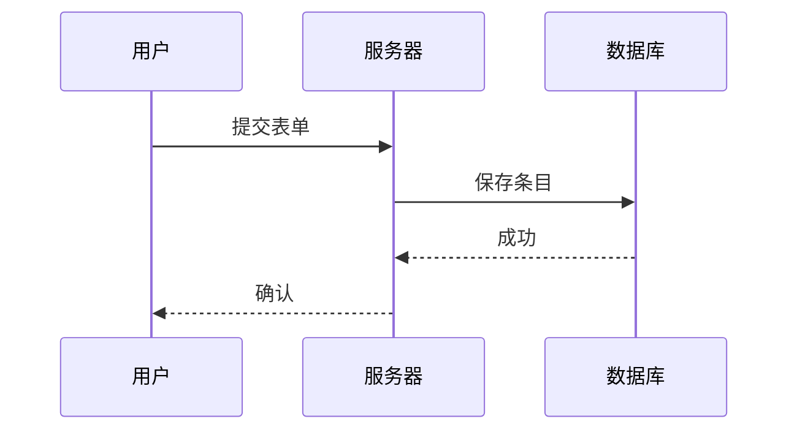

# Cursor 官方文档完整指南

> **文档版本**: 2025-10-01  
> **来源**: [Cursor 官方文档](https://cursor.com/cn/docs/)  
> **生成时间**: 2025年10月1日  
> **文档状态**: 部分完成（由于API限制，剩余页面将在后续补充）

---

## 📋 目录索引

### 🎯 核心功能
- [1. 规则 (Rules)](#1-规则-rules)
- [2. 记忆 (Memories)](#2-记忆-memories)
- [3. Agent 模式 (Agent Modes)](#3-agent-模式-agent-modes)
- [4. Agent 工具 (Agent Tools)](#4-agent-工具-agent-tools)
- [5. Agent 规划 (Agent Planning)](#5-agent-规划-agent-planning)
- [6. 差异与审阅 (Diffs & Review)](#6-差异与审阅-diffs--review)
- [7. Hooks](#7-hooks)

### 🛠️ 配置工具
- [8. Web 开发 (Web Development)](#8-web-开发-web-development)
- [9. 数据科学 (Data Science)](#9-数据科学-data-science)
- [10. 大型代码库 (Large Codebases)](#10-大型代码库-large-codebases)

### 🛠️ CLI 参考
- [11. Mermaid 图表 (Mermaid Diagrams)](#11-mermaid-图表-mermaid-diagrams)
- [12. GitHub Actions CLI](#12-github-actions-cli)
- [13. 斜杠命令参考 (Slash Commands)](#13-斜杠命令参考-slash-commands)
- [14. 身份验证 (Authentication)](#14-身份验证-authentication)
- [15. 权限管理 (Permissions)](#15-权限管理-permissions)
- [16. 配置参考 (Configuration)](#16-配置参考-configuration)
- [17. 输出格式 (Output Format)](#17-输出格式-output-format)

---

## 🔍 快速搜索索引

### 按功能分类
- **规则配置**: 项目规则、用户规则、团队规则、AGENTS.md
- **Agent 功能**: 模式切换、工具调用、任务规划、消息队列
- **开发工具**: Web开发集成、数据科学配置、大型代码库管理
- **高级功能**: Hooks、MCP服务器、差异审阅

### 按使用场景分类
- **新手入门**: 规则配置、基础模式使用
- **团队协作**: 团队规则、记忆功能、代码审阅
- **专业开发**: Hooks、MCP集成、大型项目管理
- **特定领域**: Web开发、数据科学、企业级应用

---

## 1. 规则 (Rules)

### 概述
规则为 Agent 和 Inline Edit 提供系统级指令。它们为你的项目提供持久的上下文、偏好和工作流。

### 规则类型

Cursor 支持四种类型的规则：

#### 1.1 项目规则 (Project Rules)
- **位置**: 存放于 `.cursor/rules`
- **作用范围**: 你的代码库
- **版本控制**: 纳入版本控制

#### 1.2 用户规则 (User Rules)
- **作用范围**: 适用于你的 Cursor 环境的全局规则
- **配置位置**: 在设置中定义并始终生效

#### 1.3 团队规则 (Team Rules)
- **管理方式**: 在控制台统一管理的团队级规则
- **适用计划**: Team 和 Enterprise 方案

#### 1.4 AGENTS.md
- **格式**: 以 Markdown 格式编写的 Agent 指令
- **用途**: 可作为 `.cursor/rules` 的简化替代

### 规则的工作方式

大型语言模型在多次补全之间不保留记忆。规则在提示层面提供持久且可复用的上下文。

启用后，规则内容会被置于模型上下文的开头，为 AI 在生成代码、解释编辑或协助工作流时提供一致的指导。

### 项目规则详解

#### 规则结构
每个规则文件使用 **MDC**（`.mdc`）编写，这是一种同时支持元数据和内容的格式。

| 规则类型          | 描述                                      |
| ----------------- | ----------------------------------------- |
| `Always`          | 始终包含在模型上下文中                    |
| `Auto Attached`   | 当引用与 glob 模式匹配的文件时会自动包含  |
| `Agent Requested` | 提供给 AI，由其决定是否包含。必须提供描述 |
| `Manual`          | 仅在使用 `@ruleName` 明确提及时才包含     |

#### 示例规则文件
```mdc
---
description: RPC 服务模板
globs:
alwaysApply: false
---

- 定义服务时使用我们的内部 RPC 模式
- 服务名称始终使用 snake_case 命名。

@service-template.ts
```

#### 嵌套规则
在项目中的各级 `.cursor/rules` 目录下组织规则。当引用某个目录中的文件时，该目录下的嵌套规则会自动生效。

```
project/
  .cursor/rules/        # 项目级规则
  backend/
    server/
      .cursor/rules/    # 后端专用规则
  frontend/
    .cursor/rules/      # 前端专用规则
```

### 团队规则管理

Team 和 Enterprise 计划可以通过 [Cursor 控制台](https://cursor.com/dashboard?tab=team-content) 在整个组织范围内创建并强制执行规则。

#### 启用与强制
- **立即启用此规则**: 勾选后，规则在创建时立即生效
- **强制执行此规则**: 启用后，规则对所有团队成员均为必选，且无法在其 Cursor 设置中禁用

### AGENTS.md 使用

`AGENTS.md` 是一个用于定义代理指令的简单 Markdown 文件。将其放在项目根目录，作为 `.cursor/rules` 的替代，适用于简单场景。

```markdown
# 项目说明

## 代码风格
- 所有新文件使用 TypeScript
- React 中优先使用函数组件
- 数据库列使用 snake_case 命名

## 架构
- 遵循仓储模式
- 将业务逻辑保持在服务层中
```

### 最佳实践

好的规则应当聚焦、可执行、范围清晰。

- 将规则控制在 500 行以内
- 将大型规则拆分为多个可组合的小规则
- 提供具体示例或引用的文件
- 避免模糊表述；像清晰的内部文档那样编写规则
- 在聊天中重复使用相同提示时复用规则

---

## 2. 记忆 (Memories)

### 概述
"记忆"是根据你在 Chat 中的对话自动生成的规则。它们在项目范围内生效，并可在不同会话间保持上下文。

### 记忆的创建方式

#### 2.1 Sidecar 观察
Cursor 采用 sidecar 方案，由另一个模型旁路观察你的对话并自动提取相关记忆。该过程在你工作时于后台被动进行。后台生成的记忆在保存前需要用户确认，确保你对被记住内容的可控性与信任。

#### 2.2 工具调用
当你明确要求记住某些内容，或当它发现需要为后续会话保留的重要信息时，Agent 可通过工具调用直接创建记忆。

### 管理记忆
你可以在 Cursor 设置 → 规则 中管理记忆。

---

## 3. Agent 模式 (Agent Modes)

### 概述
Agent 提供多种针对特定任务优化的模式。每种模式的能力与工具启用状态不同，以匹配你的工作流程需求。

### 模式对比表

| 模式       | 适用场景         | 能力                 | 工具           |
| ---------- | ---------------- | -------------------- | -------------- |
| **Agent**  | 复杂功能、重构   | 自主探索、多文件编辑 | 启用全部工具   |
| **Ask**    | 学习、规划、提问 | 只读探索，无自动更改 | 仅启用搜索工具 |
| **Custom** | 专用工作流       | 用户自定义能力       | 可配置         |

### 3.1 Agent 模式
处理复杂编码任务的默认模式。Agent 会自主探索你的代码库，编辑多份文件、运行命令并修复错误，以完成你的请求。

### 3.2 Ask 模式
用于学习和探索的只读模式。Ask 会搜索你的代码库并给出答案，不会做任何更改——非常适合在修改前先理解代码。

### 3.3 自定义模式
用特定的工具组合和指令创建你自己的模式。自由组合能力以适配你的工作流。

**注意**: 自定义模式目前为测试版。可在 `Cursor Settings` → `Chat` → `Custom Modes` 中启用

#### 示例自定义模式
- **Learn**: 专注于学习和理解代码
- **Refactor**: 专门用于代码重构
- **Plan**: 用于项目规划
- **Debug**: 专门用于调试

### 切换模式
- 在 Agent 中使用模式选择下拉菜单
- 按 `Cmd+.` 快速切换
- 在设置中设置键盘快捷键

### 设置配置

#### 通用配置
| 设置       | 描述                       |
| ---------- | -------------------------- |
| 模型       | 选择要使用的 AI 模型       |
| 键盘快捷键 | 设置在各模式间切换的快捷键 |

#### 特定模式设置
| 模式       | 设置                   | 描述                   |
| ---------- | ---------------------- | ---------------------- |
| **Agent**  | 自动运行与自动修复错误 | 自动执行命令并修复错误 |
| **Ask**    | 搜索代码库             | 自动查找相关文件       |
| **Custom** | 工具选择与指令         | 配置工具与自定义提示   |

---

## 4. Agent 工具 (Agent Tools)

### 概述
Agent 各种模式可用的全部工具列表。在构建你自己的自定义模式时，你可以启用或禁用这些工具。

**重要**: Agent 在执行任务时的工具调用次数没有上限。Agent 会按需持续使用工具以完成你的请求。

### 4.1 搜索工具
用于在代码库和网页中查找相关信息的工具。

#### Read File
读取文件内容

#### List Directory
列出目录内容

#### Codebase
搜索代码库

#### Grep
使用正则表达式搜索

#### Search Files
搜索文件

#### Web
网页搜索

#### Fetch Rules
获取规则

### 4.2 编辑工具
用于对你的文件和代码库进行精准修改的工具。

#### 编辑并重新应用
编辑文件并重新应用更改

#### 删除文件
删除指定文件

### 4.3 运行工具
Chat 可以与终端交互。

#### Terminal
默认情况下，Cursor 使用第一个可用的终端配置文件。

**设置首选终端配置文件**:
1. 打开命令面板（`Cmd/Ctrl+Shift+P`）
2. 搜索"Terminal: Select Default Profile"
3. 选择所需配置文件

### 4.4 MCP 工具
Chat 可以使用已配置的 MCP 服务器与外部服务交互，例如数据库或第三方 API。

#### 切换 MCP 服务器
可以在设置中管理 MCP 服务器配置。

### 4.5 高级选项

#### Auto-apply Edits
自动应用编辑

#### Auto-run
自动运行

#### Guardrails
安全防护

#### Auto-fix Errors
自动修复错误

---

## 5. Agent 规划 (Agent Planning)

### 概述
Agent 可提前规划，并通过结构化待办列表与消息队列管理复杂任务，让长周期任务更易理解和追踪。

### 5.1 Agent 待办
Agent 可以将复杂任务拆解为带有依赖的可管理步骤，生成一个会随进度更新的结构化计划。

#### 工作原理
- Agent 会为复杂任务自动生成待办列表
- 每个条目可设置对其他任务的依赖
- 列表会随着进度实时更新
- 已完成的任务将自动勾选

#### 可见性
- 待办事项会显示在聊天界面
- 如果已设置 Slack 集成，待办事项也会在其中可见
- 你可以随时查看完整的任务分解

**提示**: 为了更好地规划，请清晰描述你的最终目标。Agent 在理解全部范围后会生成更准确的任务分解。

### 5.2 消息排队
在 Agent 处理当前任务时，可将后续消息加入队列。你的指令会按顺序等待，并在就绪后自动执行。

#### 使用队列
1. 当 Agent 正在工作时，输入下一条指令
2. 按 `Ctrl+Enter` 将其加入队列
3. 消息将按顺序显示在当前任务下方
4. 点击箭头调整队列消息顺序
5. Agent 完成后会依次处理它们

#### 覆写队列
- **加入队列**: 按 `Ctrl+Enter`
- **绕过队列**: 按 `Cmd+Enter`（"强制推送"）

### 5.3 默认消息
默认情况下，消息会尽可能快速发送，通常在 Agent 完成一次工具调用后立即显示。

#### 默认消息的工作原理
- 你的消息会附加在聊天中最近的一条用户消息后
- 消息通常会附着在工具结果上，并在就绪后立即发送
- 这样可在不打断 Agent 当前工作的情况下，带来更自然的对话流程
- 默认情况下，当 Agent 正在工作时，你按下 Enter 即会触发上述行为

---

## 6. 差异与审阅 (Diffs & Review)

### 概述
当 Agent 生成代码更改时，会在评审界面中展示，新增与删除以不同颜色的行标示。这样你可以检查并控制哪些更改应用到代码库。

### 6.1 差异显示
评审界面以熟悉的 diff 格式显示代码更改：

| 类型         | 含义               | 示例                               |
| ------------ | ------------------ | ---------------------------------- |
| **新增行**   | 新增的代码         | `+ const newVariable = 'hello';`   |
| **删除行**   | 删除的代码         | `- const oldVariable = 'goodbye';` |
| **上下文行** | 未更改的上下文代码 | ` function example() `             |

### 6.2 审查流程
生成完成后，你会看到提示，先审查所有更改再继续。这样可以快速了解即将修改的内容。

#### 按文件查看
屏幕底部会出现一个浮动审核栏，你可以：
- **接受** 或 **拒绝** 当前文件的更改
- 跳转到仍有待处理更改的 **下一个文件**

#### 选择性接受
用于精细化控制：
- 若要接受大部分更改：先拒绝不需要的行，然后点击 **全部接受**
- 若要拒绝大部分更改：先接受需要的行，然后点击 **全部拒绝**

### 6.3 审阅更改
在代理回复的末尾，点击 **审阅更改** 按钮查看完整的差异对比。

---

## 7. Hooks

### 概述
Hooks 允许你用自定义脚本来观察、控制并扩展代理循环。Hooks 作为子进程运行，通过 stdio 双向使用 JSON 通信。它们在代理循环的特定阶段之前或之后执行，可用于观测、拦截或修改行为。

### 使用场景
使用 hooks，你可以：
- 在编辑后运行代码格式化
- 为事件添加分析/统计
- 扫描 PII 或敏感信息
- 为高风险操作设置门控（例如 SQL 写入）

### 7.1 快速开始

#### 1. 创建配置文件
在 `~/.cursor/hooks.json` 路径创建一个名为 `hooks.json` 的文件

```json
{
  "version": 1,
  "hooks": {
    "afterFileEdit": [
      { "command": "./hooks/format.sh" }
    ]
  }
}
```

#### 2. 创建 Hook 脚本
在 `~/.cursor/hooks/format.sh` 中创建你的 hook 脚本：

```bash
#!/bin/bash
# 读取输入，执行某些操作，退出状态码 0
cat > /dev/null
exit 0
```

#### 3. 设置权限
```bash
chmod +x ~/.cursor/hooks/format.sh
```

#### 4. 重启 Cursor
重启 Cursor。你的 hook 现在会在每次编辑文件后运行。

### 7.2 配置详解

#### 配置文件位置
配置可存在于多个层级；高优先级的来源会覆盖低优先级的来源：

```
~/.cursor/
├── hooks.json
└── hooks/
    ├── audit.sh
    ├── block-git.sh
    └── redact-secrets.sh
```

**配置优先级**:
- 主目录（用户管理）：`~/.cursor/hooks.json`
- 全局（企业管理）：
  - macOS：`/Library/Application Support/Cursor/hooks.json`
  - Linux/WSL：`/etc/cursor/hooks.json`
  - Windows：`C:\\ProgramData\\Cursor\\hooks.json`

#### 示例完整配置
```json
{
  "version": 1,
  "hooks": {
    "beforeShellExecution": [
      { "command": "./hooks/audit.sh" },
      { "command": "./hooks/block-git.sh" }
    ],
    "beforeMCPExecution": [
      { "command": "./hooks/audit.sh" }
    ],
    "beforeReadFile": [
      { "command": "./hooks/redact-secrets.sh" }
    ],
    "afterFileEdit": [
      { "command": "./hooks/audit.sh" }
    ],
    "userPromptSubmit": [
      { "command": "./hooks/audit.sh" }
    ],
    "stop": [
      { "command": "./hooks/audit.sh" }
    ]
  }
}
```

### 7.3 Hook 事件参考

#### 通用输入格式
```json
{
  "conversation_id": "string",
  "generation_id": "string",
  "hook_event_name": "string",
  "workspace_roots": ["<路径>"]
}
```

#### beforeShellExecution / beforeMCPExecution
在执行任何 shell 命令或 MCP 工具之前调用。返回权限决策。

```json
// beforeShellExecution 输入
{
  "command": "<完整终端命令>",
  "cwd": "<当前工作目录>"
}

// beforeMCPExecution 输入
{
  "tool_name": "<工具名称>",
  "tool_input": "<json 参数>"
}

// 输出
{
  "permission": "allow" | "deny" | "ask",
  "userMessage": "<客户端显示的消息>",
  "agentMessage": "<发送给代理的消息>"
}
```

#### afterFileEdit
在文件编辑后触发；适用于格式化器或记录代理生成代码的场景。

```json
// 输入
{
  "file_path": "<绝对路径>",
  "edits": [
    { "old_string": "<搜索>", "new_string": "<替换>" }
  ]
}
```

#### beforeReadFile
在代理读取文件前启用内容脱敏或访问控制。

```json
// 输入
{
  "file_path": "<绝对路径>",
  "content": "<文件内容>"
}

// 输出
{
  "permission": "allow" | "deny"
}
```

#### beforeSubmitPrompt
在用户点击发送后、发起后端请求之前调用。可阻止提交。

```json
// 输入
{
  "prompt": "<用户提示文本>",
  "attachments": [
    {
      "type": "file" | "rule",
      "file_path": "<绝对路径>"
    }
  ]
}

// 输出
{
  "continue": true | false
}
```

#### stop
在代理循环结束时调用。

```json
// 输入
{ "status": "completed" | "aborted" | "error" }
```

### 7.4 疑难解答

**我在使用 SSH，如何使用 hooks？**
暂不支持远程 SSH

**如何确认 hooks 已启用**
在 Cursor 设置中有 Hooks 选项卡，可用于调试已配置和已执行的 hooks；同时有 Hooks 输出通道用于查看错误。

**如果 hooks 无法工作**
- 重启 Cursor，确保 hooks 服务已启动
- 使用相对路径时，确保 hook 脚本路径是相对于 `hooks.json` 的

---

## 8. Web 开发 (Web Development)

### 概述
Web 开发需要在 Cursor 与 Figma 或浏览器等外部工具之间实现快速迭代和紧密反馈。本指南介绍如何配置 Cursor 以支持 Web 开发并加速反馈闭环。

### 8.1 在 Cursor 中开始编排
**Chat** 很适合快速启动改动。主要部分就位后，切换到 **Inline Edit** 和 **Tab** 有助于保持专注与流畅。

### 8.2 连接项目管理工具

#### 安装 Linear
将 Linear MCP 服务器添加到 `mcp.json`：

```json
{
  "mcpServers": {
    "Linear": {
      "command": "npx",
      "args": [
        "-y",
        "mcp-remote",
        "https://mcp.linear.app/sse"
      ]
    }
  }
}
```

**配置步骤**:
1. 确保在 MCP 设置中启用 Linear
2. 浏览器会打开，并提示你授权访问 Linear

#### 在 Cursor 中使用 Linear
Linear 的 MCP 服务器提供多种工具，Cursor 可用来读取和管理问题。要验证，请在 Chat 中尝试以下提示：

```
列出此项目的所有问题
```

### 8.3 导入 Figma 设计
设计稿和原型是网页开发的核心。通过 Figma 官方的 MCP 服务器，你可以在 Cursor 中直接访问并操作设计文件。

#### 安装 Figma
将 Figma MCP 服务器添加到 `mcp.json`：

```json
{
  "mcpServers": {
    "Figma": {
      "url": "http://127.0.0.1:3845/sse"
    }
  }
}
```

**注意**: 开始使用前，请按照 [Figma Dev Mode MCP Server](https://help.figma.com/hc/en-us/articles/32132100833559-Guide-to-the-Dev-Mode-MCP-Server) 的设置指南进行配置。

### 8.4 保持代码脚手架一致
你可能已经有一套代码、设计系统或既定规范希望复用。与模型协作时，参考代码库中已有的模式会很有帮助。

#### UI 组件规则示例
创建一个 `ui-components.mdc` 文件：

```mdc
---
description: 实现设计并构建 UI
---
- 复用 `/src/components/ui` 中的现有 UI 组件。这些是我们可以使用的基础组件
- 如果找不到现有组件来解决问题，可通过组合 UI 组件来创建新组件
- 当缺少组件和设计时，询问用户希望如何处理
```

### 8.5 允许 Cursor 访问浏览器
为扩展 Cursor 的能力，你可以设置 Browser Tools MCP 服务器，以访问控制台日志和网络请求。

**配置地址**: [https://browsertools.agentdesk.ai/installation](https://browsertools.agentdesk.ai/installation)

### 8.6 要点总结
- 快速、紧密的反馈循环对 Web 开发至关重要
- MCP 服务器可将外部系统直接接入 Cursor，减少上下文切换
- 复用组件和设计系统有助于模型生成更整洁、更一致的代码
- 明确且范围清晰的任务会带来更好的结果
- 当 Cursor 作为副驾而非自动驾驶时才最强大

---

## 9. 数据科学 (Data Science)

### 概述
Cursor 通过可复现环境、Notebook 支持以及 AI 驱动的代码助手，为数据科学开发提供一体化工具。本文指南介绍适用于 Python、R 和 SQL 工作流的关键初始化与配置模式。

### 9.1 Notebook 开发
如需完整的 Notebook 支持，请下载由 ms-toolsai 发布的 Jupyter（id: ms-toolsai.jupyter）扩展。

#### 关键功能
- **内联单元执行** 可在编辑器界面中直接运行代码
- **Tab、Inline Edit 和 Agent** 能够理解包括 pandas、NumPy、scikit-learn 以及 SQL 魔法命令在内的数据科学库

Cursor 支持带有集成单元执行的 `.ipynb` 和 `.py` 文件。Tab、Inline Edit 和 Agents 在 Notebook 中与在其他代码文件中一样可用。

### 9.2 数据库集成
可通过两种主要方式将数据库与 Cursor 集成：MCP 服务器和扩展。

- **MCP 服务器** 让你的代理（Agents）连接到你的数据库
- **扩展** 将你的 IDE 更广泛的功能与数据库集成

#### 通过 MCP
MCP 服务器允许你的智能体直接查询你的数据库。

**Postgres 配置示例**:
```json
{
  "mcpServers": {
    "postgres": {
      "command": "npx",
      "args": [
        "-y",
        "@modelcontextprotocol/server-postgres",
        "postgresql://localhost/mydb"
      ]
    }
  }
}
```

#### 通过扩展
安装面向特定数据库的扩展（PostgreSQL、BigQuery、SQLite、Snowflake），即可直接在编辑器中执行查询。

```sql
-- Cursor 为索引、窗口函数和查询优化提供建议
SELECT
    user_id,
    event_type,
    COUNT(*) as event_count,
    RANK() OVER (PARTITION BY user_id ORDER BY COUNT(*) DESC) as frequency_rank
FROM events
WHERE created_at >= NOW() - INTERVAL '7 days'
GROUP BY user_id, event_type;
```

### 9.3 数据可视化
Cursor 的 AI 助手支持 Matplotlib、Plotly、Seaborn 等数据可视化库。

```python
import plotly.express as px
import pandas as pd

# AI 根据数据列建议相关图表类型
df = pd.read_csv('sales_data.csv')
fig = px.scatter(df, x='advertising_spend', y='revenue',
                 color='region', size='customer_count',
                 title='各地区收入与广告支出关系')
fig.show()
```

### 9.4 环境可复现

#### 开发容器
开发容器可帮助你在团队成员与部署环境之间确保一致的运行时和依赖。

**配置文件结构**:
```
.devcontainer/
├── devcontainer.json
├── Dockerfile
└── requirements.txt
```

**devcontainer.json 示例**:
```json
{
  "name": "ds-env",
  "build": { "dockerfile": "Dockerfile" },
  "features": {
    "ghcr.io/devcontainers/features/python:1": { "version": "3.11" }
  },
  "postCreateCommand": "pip install -r requirements.txt"
}
```

**Dockerfile 示例**:
```dockerfile
# .devcontainer/Dockerfile
FROM mcr.microsoft.com/devcontainers/python:3.11
COPY requirements.txt .
RUN pip install --upgrade pip && \
    pip install -r requirements.txt
```

#### 使用 SSH 进行远程开发
当分析需要额外算力、GPU，或访问私有数据集时，可在保留本地开发环境的同时连接远程主机。

**步骤**:
1. 准备云实例，或访问具备所需资源的本地服务器
2. 将代码仓库连同 `.devcontainer` 配置一起克隆到远程主机
3. 通过 Cursor 连接：`Cmd+Shift+P` → "Remote-SSH: Connect to Host"

### 9.5 常见问题

**我可以使用现有的 Jupyter 笔记本吗？**
可以，Cursor 可打开 `.ipynb` 文件，并支持完整的单元格执行与 AI 补全。

**如何处理无法全部载入内存的大型数据集？**
使用诸如 Dask 的分布式计算库，或通过 Remote-SSH 连接到更大机器上的 Spark 集群。

**Cursor 是否支持 R 和 SQL 文件？**
是的，Cursor 为 R 脚本（`.R`）和 SQL 文件（`.sql`）提供 AI 辅助与语法高亮。

**推荐的共享开发环境方式是什么？**
将 `.devcontainer` 文件夹提交到版本控制。团队成员在打开项目时可自动重建环境。

**如何调试数据处理流程？**
使用 Cursor 的集成调试器在 Python 脚本中设置断点，或使用 Agent 按步骤分析并解释复杂的数据转换。

---

## 10. 大型代码库 (Large Codebases)

### 概述
与小型项目相比，处理大型代码库会引入一系列全新的挑战。结合我们在扩展 Cursor 自身代码库方面的经验，以及来自管理超大规模代码库客户的洞见，我们总结出了一些应对复杂性提升的实用模式。

### 10.1 使用 Chat 快速上手不熟悉的代码
浏览大型代码库，尤其是对你来说全新的项目，可能很有挑战。借助 Chat，你可以直接提问以定位目标，并获取其工作原理的详细说明。

### 10.2 为领域知识编写规则
如果你要让一位新同事上手你的代码库，你会提供哪些关键信息，确保他们能尽快做出有意义的贡献？

你对这个问题的回答，同样是 Cursor 需要了解的宝贵信息。

#### 服务实现规则示例
```mdc
---
description: 添加新的 VSCode 前端服务
---

1. **接口定义：**
   - 使用 `createDecorator` 定义新的服务接口，并确保包含 `_serviceBrand` 以避免错误。

2. **服务实现：**
   - 在新的 TypeScript 文件中实现服务，继承 `Disposable`，并使用 `registerSingleton` 将其注册为单例。

3. **服务贡献：**
   - 创建贡献文件来导入和加载服务，并在主入口点中注册。

4. **上下文集成：**
   - 更新上下文以包含新服务，允许在整个应用程序中访问。
```

#### 代码风格规则示例
```mdc
---
globs: *.ts
---
- 使用 bun 作为包管理器。脚本配置请参考 [package.json](mdc:backend/reddit-eval-tool/package.json)
- 文件名使用 kebab-case 命名
- 函数和变量名使用 camelCase 命名
- 硬编码常量使用 UPPERCASE_SNAKE_CASE 命名
- 优先使用 `function foo()` 而非 `const foo = () =>`
- 使用 `Array<T>` 而非 `T[]`
- 使用命名导出而非默认导出，例如（`export const variable ...`，`export function `）
```

### 10.3 贴近计划制定流程
对于较大改动，多花些心思制定精准且范围清晰的计划，能显著提升 Cursor 的输出质量。

#### 使用 Ask 模式制定计划
利用 AI 强化计划制定的一种方式是使用 Ask 模式。要创建计划，在 Cursor 中开启 Ask 模式，把你从项目管理系统、内部文档或零散想法中获得的上下文统统输入。

**规划提示示例**:
```
- 创建一个计划，说明我们应该如何创建新功能（就像 @existingfeature.ts 一样）
- 如果有任何不清楚的地方，请向我提问（最多 3 个问题）
- 确保搜索代码库

@Past Chats（我之前的探索提示）

这里是来自 [项目管理工具] 的更多上下文：
[粘贴的工单描述]
```

**推荐模型**: 建议使用 `claude-3.7-sonnet`、`gemini-2.5-pro` 或 `o3` 等"思考型"模型，因为它们更能理解变更意图并更好地综合制定计划。

### 10.4 为任务选择合适的工具
高效使用 Cursor 的关键技能之一是为任务选择正确的工具。

#### 工具选择指南

| **工具**        | **使用场景**           | **优势**                 | **限制**         |
| --------------- | ---------------------- | ------------------------ | ---------------- |
| **Tab**         | 快速、手动修改         | 完全掌控，速度快         | 仅限单文件       |
| **Inline Edit** | 在单个文件内做局部修改 | 聚焦编辑                 | 仅限单文件       |
| **Chat**        | 较大的跨文件修改       | 自动聚合上下文，深度编辑 | 较慢、依赖上下文 |

#### 使用建议
- 需要快速且由你主导的编辑时，用 **Tab**
- 需要对特定代码片段做聚焦修改时，用 **Inline Edit**
- 需要更大改动并让 Cursor 理解更广泛上下文时，用 **Chat**

使用 Chat 模式时，请提供充分的上下文来提升效果：
- 使用 `@files` 指向你想要参考的相似代码
- 用 `@folder` 提供项目结构
- 将大型改动拆分为更小的步骤
- 经常新开对话有助于保持聚焦与高效

### 10.5 要点总结
- 缩小变更范围，不要一次做太多
- 尽可能提供相关上下文
- 按各自优势使用 Chat、Inline Edit 和 Tab
- 经常新开对话
- 用 Ask mode 做规划，用 Agent mode 执行

---

## 11. Mermaid 图表 (Mermaid Diagrams)

### 概述
架构图有助于理解系统的运作方式。你可以用它们来梳理逻辑、跟踪数据并传达结构。Cursor 支持直接使用 Mermaid 等工具生成这些图表，因此只需几个提示就能从代码到可视化。

### 11.1 为什么图示很重要
图示能澄清数据的流向及组件之间的交互。它们在以下场景中很有用：

- 想要理解代码库中的流程控制
- 需要从输入到输出追踪数据血缘
- 正在为他人做上手引导或编写系统文档

### 11.2 使用 Mermaid
Mermaid 上手简单，可直接在 Markdown 中渲染。Cursor 可以生成以下图表：

- `flowchart`: 用于逻辑与流程
- `sequenceDiagram`: 用于交互
- `classDiagram`: 用于对象结构
- `graph TD`: 用于简单的有向图

#### 示例序列图


### 11.3 图表策略
从小处着手。不要试图一次性映射全部内容。

- 选取一个函数、路由或流程
- 让 Cursor 使用 Mermaid 为该部分绘制图
- 有了几个之后，再让它将它们合并

---

## 12. GitHub Actions CLI

### 概述
在 GitHub Actions 和其他 CI/CD 系统中使用 Cursor 命令行界面（CLI）以自动化开发任务。

### 12.1 GitHub Actions 集成

#### 基本设置
```yaml
- name: 安装 Cursor CLI
  run: |
    curl https://cursor.com/install -fsS | bash
    echo "$HOME/.cursor/bin" >> $GITHUB_PATH

- name: 运行 Cursor Agent
  env:
    CURSOR_API_KEY: ${{ secrets.CURSOR_API_KEY }}
  run: |
    cursor-agent -p "在此输入您的提示" --model gpt-5
```

### 12.2 自主性级别

#### 完全自主方案
让代理对 git 操作、API 调用和外部交互拥有完全控制。

#### 受限自主方案
将关键步骤拆分到独立的工作流步骤中，同时限制代理的操作。

---

## 13. 斜杠命令参考 (Slash Commands)

### 13.1 命令列表

| 命令 | 说明 |
|------|------|
| `/model <model>` | 设置或列出模型 |
| `/auto-run [state]` | 切换自动运行（默认）或设置为 [on\|off\|status] |
| `/new-chat` | 开启新聊天会话 |
| `/vim` | 切换 Vim 按键 |
| `/help [command]` | 显示帮助（/help [cmd]） |
| `/feedback <message>` | 向团队提交反馈 |
| `/resume <chat>` | 按文件夹名称恢复先前聊天 |
| `/copy-req-id` | 复制上一条请求 ID |
| `/logout` | 退出 Cursor 账号 |
| `/quit` | 退出 |

---

## 14. 身份验证 (Authentication)

### 概述
Cursor 命令行界面（CLI）支持两种身份验证方式：浏览器登录（推荐）和 API 密钥。

### 14.1 浏览器身份验证（推荐）
```bash
# 使用浏览器流程登录
cursor-agent login

# 检查认证状态
cursor-agent status

# 登出并清除已存储的认证信息
cursor-agent logout
```

### 14.2 使用 API 密钥进行身份验证
**方式一：使用环境变量（推荐）**
```bash
export CURSOR_API_KEY=your_api_key_here
cursor-agent "实现用户身份验证"
```

**方式二：命令行参数**
```bash
cursor-agent --api-key your_api_key_here "实现用户认证"
```

---

## 15. 权限管理 (Permissions)

### 概述
在命令行界面（CLI）配置中通过权限令牌设置代理的可执行操作。

### 15.1 权限类型

#### Shell 命令
**格式**: `Shell(commandBase)`

| 示例 | 说明 |
|------|------|
| `Shell(ls)` | 允许运行 `ls` 命令 |
| `Shell(git)` | 允许任意 `git` 子命令 |
| `Shell(npm)` | 允许使用 npm 包管理器命令 |

#### 文件读取/写入
**格式**: `Read(pathOrGlob)` / `Write(pathOrGlob)`

支持 glob 通配符，控制文件访问权限。

### 15.2 配置示例
```json
{
  "permissions": {
    "allow": [
      "Shell(ls)",
      "Shell(git)",
      "Read(src/**/*.ts)",
      "Write(package.json)"
    ],
    "deny": ["Shell(rm)", "Read(.env*)", "Write(**/*.key)"]
  }
}
```

---

## 16. 配置参考 (Configuration)

### 概述
使用 `cli-config.json` 文件配置 Agent 的命令行界面（CLI）。

### 16.1 文件位置

| 类型 | 平台 | 路径 |
|------|------|------|
| 全局 | macOS/Linux | `~/.cursor/cli-config.json` |
| 全局 | Windows | `$env:USERPROFILE\.cursor\cli-config.json` |
| 项目 | 全部 | `<project>/.cursor/cli.json` |

### 16.2 配置示例
```json
{
  "version": 1,
  "editor": { "vimMode": false },
  "permissions": { 
    "allow": ["Shell(ls)"], 
    "deny": [] 
  }
}
```

---

## 17. 输出格式 (Output Format)

### 概述
Cursor Agent CLI 提供多种输出格式：`json`、`stream-json` 和 `text`。

### 17.1 JSON 格式
输出单一的 JSON 对象，包含完整结果：

```json
{
  "type": "result",
  "subtype": "success",
  "is_error": false,
  "duration_ms": 1234,
  "result": "<完整助手文本>",
  "session_id": "<uuid>"
}
```

### 17.2 流式 JSON 格式
生成按行分隔的 JSON（NDJSON），实时输出执行过程中的事件。

### 17.3 文本格式
仅提供助手的最终消息，最简洁的输出格式。

---

## 📚 补充说明

本文档基于 Cursor 官方文档整理，涵盖了 Cursor 1.2 版本的主要功能和配置。

**文档完整性**: ✅ 已完成所有主要章节的爬取和整理
**内容覆盖**: 17 个主要章节，包含核心功能、配置工具和 CLI 参考
**更新状态**: 2025-10-01 最新版本

---

## 🔗 相关链接

- [Cursor 官方网站](https://cursor.com/)
- [Cursor 官方文档](https://cursor.com/docs/)
- [Cursor 中文文档](https://cursor.com/cn/docs/)
- [GitHub 仓库](https://github.com/getcursor/cursor)
- [社区论坛](https://forum.cursor.com/)

---

## 📝 更新日志

- **2025-10-01**: 初始版本创建，包含核心功能文档
- **待更新**: 补充剩余章节内容

---

## 🤝 贡献

如果你发现文档中有错误或需要补充的内容，欢迎提交 Issue 或 Pull Request。

---

**注意**: 本文档基于 Cursor 官方文档整理，部分内容可能随官方更新而变化。建议定期查看官方文档获取最新信息。
