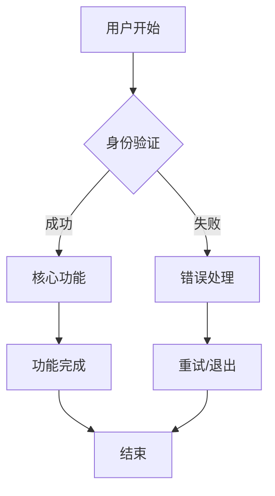

# 产品需求文档 (PRD)

## 1. 产品概述

### 1.1 产品愿景
{PRODUCT_VISION}

### 1.2 产品目标
- 主要目标：{PRIMARY_GOAL}
- 次要目标：{SECONDARY_GOAL}

### 1.3 非目标 (Out of Scope)
- {OUT_OF_SCOPE_1}
- {OUT_OF_SCOPE_2}
- {OUT_OF_SCOPE_3}

## 2. 用户画像

### 2.1 主要用户
- **用户类型:** {PRIMARY_USER_TYPE}
- **特征:** {PRIMARY_USER_CHARACTERISTICS}
- **需求:** {PRIMARY_USER_NEEDS}

### 2.2 次要用户
- **用户类型:** {SECONDARY_USER_TYPE}
- **特征:** {SECONDARY_USER_CHARACTERISTICS}
- **需求:** {SECONDARY_USER_NEEDS}

## 3. 功能需求

### 3.1 MoSCoW 优先级

#### Must Have (必须有)
- {MUST_HAVE_1}
- {MUST_HAVE_2}
- {MUST_HAVE_3}

#### Should Have (应该有)
- {SHOULD_HAVE_1}
- {SHOULD_HAVE_2}

#### Could Have (可以有)
- {COULD_HAVE_1}
- {COULD_HAVE_2}

#### Won't Have (暂不实现)
- {WONT_HAVE_1}
- {WONT_HAVE_2}

### 3.2 主要业务流程



### 3.3 功能详细说明

#### 3.3.1 核心功能
**功能描述:** {CORE_FUNCTION_DESCRIPTION}

**用户场景:**
1. {USER_SCENARIO_1}
2. {USER_SCENARIO_2}
3. {USER_SCENARIO_3}

**验收标准:**
- [ ] {ACCEPTANCE_CRITERIA_1}
- [ ] {ACCEPTANCE_CRITERIA_2}
- [ ] {ACCEPTANCE_CRITERIA_3}

## 4. 接口与数据契约

### 4.1 API 接口设计

#### 4.1.1 用户认证
```
POST /api/auth/login
Request: { username: string, password: string }
Response: { token: string, user: UserInfo }
```

#### 4.1.2 核心功能接口
```
GET /api/{resource}
Response: { data: Array<Resource>, total: number }
```

### 4.2 数据模型

#### 4.2.1 用户模型
```typescript
interface User {
  id: string;
  username: string;
  email: string;
  createdAt: Date;
  updatedAt: Date;
}
```

#### 4.2.2 核心业务模型
```typescript
interface {CORE_ENTITY} {
  id: string;
  name: string;
  description?: string;
  status: 'active' | 'inactive';
  createdAt: Date;
  updatedAt: Date;
}
```

### 4.3 错误处理策略

#### 4.3.1 HTTP 状态码
- 200: 成功
- 400: 请求参数错误
- 401: 未授权
- 403: 禁止访问
- 404: 资源不存在
- 500: 服务器内部错误

#### 4.3.2 错误响应格式
```typescript
interface ErrorResponse {
  code: string;
  message: string;
  details?: any;
  timestamp: string;
}
```

#### 4.3.3 重试策略
- 网络错误：指数退避重试，最多 3 次
- 服务器错误：立即重试，最多 2 次
- 客户端错误：不重试

#### 4.3.4 超时设置
- API 调用：30 秒
- 数据库查询：10 秒
- 外部服务调用：60 秒

## 5. 非功能需求

### 5.1 性能要求
- 响应时间：< {RESPONSE_TIME}ms
- 并发用户：> {CONCURRENT_USERS}
- 吞吐量：> {THROUGHPUT} TPS

### 5.2 可用性要求
- 系统可用性：> {AVAILABILITY}%
- 故障恢复时间：< {RECOVERY_TIME}分钟

### 5.3 安全要求
- 数据加密：AES-256
- 传输安全：TLS 1.3
- 身份认证：JWT + OAuth 2.0

### 5.4 可观测性要求
- 监控指标：响应时间、错误率、吞吐量
- 日志级别：INFO、WARN、ERROR
- 告警阈值：错误率 > 5%

## 6. 验收标准矩阵

| 用户故事 | 测试用例 | 验收标准              | 负责人  | 状态   |
| -------- | -------- | --------------------- | ------- | ------ |
| US-001   | TC-001   | {ACCEPTANCE_CRITERIA} | {OWNER} | 待开发 |
| US-002   | TC-002   | {ACCEPTANCE_CRITERIA} | {OWNER} | 待开发 |
| US-003   | TC-003   | {ACCEPTANCE_CRITERIA} | {OWNER} | 待开发 |

## 7. 风险评估

### 7.1 技术风险
- **风险:** {TECHNICAL_RISK}
- **影响:** {IMPACT}
- **缓解措施:** {MITIGATION}

### 7.2 业务风险
- **风险:** {BUSINESS_RISK}
- **影响:** {IMPACT}
- **缓解措施:** {MITIGATION}

### 7.3 时间风险
- **风险:** {TIMELINE_RISK}
- **影响:** {IMPACT}
- **缓解措施:** {MITIGATION}

## 8. 发布计划

### 8.1 版本规划
- **v1.0 (MVP):** {MVP_FEATURES}
- **v1.1:** {V1_1_FEATURES}
- **v2.0:** {V2_0_FEATURES}

### 8.2 发布标准
- 所有 Must Have 功能完成
- 单元测试覆盖率 > 80%
- 集成测试通过
- 性能测试通过
- 安全扫描通过
