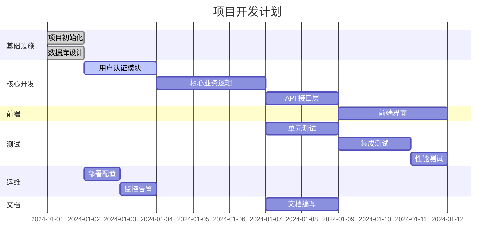

# 任务分解

## 任务列表

| 任务ID | 任务名称     | 模块     | 负责人 | 工时(小时) | 依赖   | 优先级 | DoD               | 交付物路径                     |
| ------ | ------------ | -------- | ------ | ---------- | ------ | ------ | ----------------- | ------------------------------ |
| TB-001 | 项目初始化   | 基础设施 | DEV    | 4          | -      | P0     | 项目结构创建完成  | src/, tests/, docs/            |
| TB-002 | 用户认证模块 | 认证     | DEV    | 16         | TB-001 | P0     | 登录/注册功能可用 | src/auth/, tests/auth/         |
| TB-003 | 核心业务逻辑 | 业务     | DEV    | 24         | TB-002 | P0     | 主要功能实现      | src/business/, tests/business/ |
| TB-004 | API 接口层   | 接口     | DEV    | 12         | TB-003 | P0     | REST API 可用     | src/api/, tests/api/           |
| TB-005 | 数据库设计   | 数据     | ARCH   | 8          | -      | P0     | 数据模型定义      | docs/database/                 |
| TB-006 | 前端界面     | 界面     | DEV    | 20         | TB-004 | P1     | 用户界面可用      | src/frontend/, tests/frontend/ |
| TB-007 | 单元测试     | 测试     | QA     | 16         | TB-003 | P1     | 测试覆盖率>80%    | tests/unit/                    |
| TB-008 | 集成测试     | 测试     | QA     | 12         | TB-004 | P1     | 端到端测试通过    | tests/integration/             |
| TB-009 | 性能测试     | 测试     | QA     | 8          | TB-004 | P2     | 性能指标达标      | tests/performance/             |
| TB-010 | 部署配置     | 运维     | OPS    | 6          | TB-001 | P1     | 部署脚本可用      | deploy/, docker/               |
| TB-011 | 监控告警     | 运维     | OPS    | 8          | TB-010 | P2     | 监控系统就绪      | monitoring/                    |
| TB-012 | 文档编写     | 文档     | TW     | 10         | TB-003 | P2     | 用户文档完成      | docs/user/                     |

## 甘特图

## 燃尽图

| 日期       | 剩余工时 | 完成工时 | 累计完成率 |
| ---------- | -------- | -------- | ---------- |
| 2024-01-01 | 144      | 0        | 0%         |
| 2024-01-02 | 128      | 16       | 11%        |
| 2024-01-03 | 96       | 48       | 33%        |
| 2024-01-04 | 64       | 80       | 56%        |
| 2024-01-05 | 32       | 112      | 78%        |
| 2024-01-06 | 0        | 144      | 100%       |

## 关键路径

1. **TB-001** → **TB-002** → **TB-003** → **TB-004** → **TB-006**
2. **TB-005** → **TB-003** (并行)
3. **TB-007** → **TB-008** → **TB-009** (测试路径)

## 风险任务

| 任务ID | 风险描述                     | 影响    | 缓解措施                 |
| ------ | ---------------------------- | ------- | ------------------------ |
| TB-003 | 业务逻辑复杂度可能超预期     | 延期2天 | 提前技术预研，分解子任务 |
| TB-006 | 前端技术选型可能影响开发效率 | 延期1天 | 快速原型验证技术栈       |
| TB-008 | 集成测试环境搭建复杂         | 延期1天 | 提前准备测试环境         |

## 里程碑

- **M1 (2024-01-03):** 核心功能开发完成
- **M2 (2024-01-05):** 测试完成，功能稳定
- **M3 (2024-01-06):** 部署上线，项目交付

## 资源分配

| 角色 | 分配任务                               | 总工时 | 工作负载 |
| ---- | -------------------------------------- | ------ | -------- |
| DEV  | TB-001, TB-002, TB-003, TB-004, TB-006 | 76h    | 100%     |
| QA   | TB-007, TB-008, TB-009                 | 36h    | 100%     |
| OPS  | TB-010, TB-011                         | 14h    | 70%      |
| TW   | TB-012                                 | 10h    | 50%      |
| ARCH | TB-005                                 | 8h     | 40%      |

## 质量门禁

### 开发阶段
- [ ] 代码审查通过
- [ ] 单元测试覆盖率 > 80%
- [ ] 静态代码分析通过
- [ ] 安全扫描通过

### 测试阶段
- [ ] 所有测试用例通过
- [ ] 性能测试达标
- [ ] 兼容性测试通过
- [ ] 用户验收测试通过

### 发布阶段
- [ ] 部署脚本验证通过
- [ ] 监控系统就绪
- [ ] 回滚方案准备就绪
- [ ] 文档更新完成
