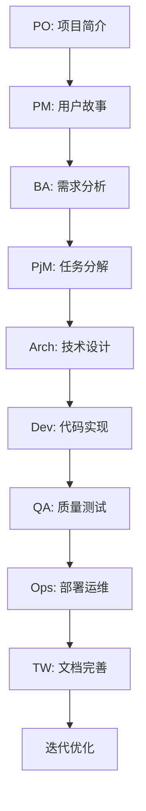

# Cursor 多角色 Agent 团队模板使用指南

## 概述

本项目是一个完整的 **Cursor
AI 多角色 Agent 团队模板**，可用于快速搭建新项目的 Agent 协作体系。通过标准化的角色定义、阶段流程和交接规范，实现从 0→1 的自主项目交付。

## 🎯 模板核心价值

### 1. 标准化 Agent 团队

- **10 个专业角色**：PO/PM/BA/PjM/Arch/LLME/DEV/QA/Ops/TW
- **7 个标准阶段**：用户故事→PRD→任务分解→技术设计→实现→测试→迭代
- **统一交接格式**：JSON Schema 确保信息传递一致性

### 2. 完整工程体系

- **代码质量**：ESLint + Prettier + TypeScript 严格模式
- **测试体系**：单元测试 + 集成测试 + E2E 测试
- **CI/CD 就绪**：Docker + 部署脚本 + 监控配置
- **文档规范**：自动生成 + 多格式支持

### 3. Cursor IDE 深度集成

- **规则系统**：`.cursor/rules/` 项目级规则配置
- **MCP 协议**：外部系统集成能力
- **任务自动化**：VSCode Tasks + 调试配置
- **智能提示**：角色上下文 + 阶段模板

## 🚀 快速开始新项目

### 方法一：直接克隆模板

```bash
# 1. 克隆模板项目
git clone https://github.com/Poghappy/cursor-.git my-new-project
cd my-new-project

# 2. 初始化新项目
make init-new-project PROJECT_NAME="my-awesome-app"

# 3. 配置环境
cp .env.example .env
# 编辑 .env 文件配置项目特定变量

# 4. 安装依赖并启动
make quick-start
```

### 方法二：使用生成脚本

```bash
# 1. 运行项目生成器
./scripts/create-project.sh

# 2. 按提示输入项目信息
# - 项目名称
# - 技术栈选择
# - 功能模块
# - 团队配置

# 3. 自动生成完整项目结构
```

## 📁 模板结构解析

### 核心目录说明

```
cursor-multi-agent-template/
├── 📂 prompts/                 # Agent 角色与阶段定义
│   ├── 📂 roles/              # 10个专业角色提示词
│   │   ├── po.md             # Product Owner
│   │   ├── pm.md             # Product Manager
│   │   ├── ba.md             # Business Analyst
│   │   ├── pjm.md            # Project Manager
│   │   ├── arch.md           # Architect
│   │   ├── llme.md           # LLM Engineer
│   │   ├── dev.md            # Developer
│   │   ├── qa.md             # Quality Assurance
│   │   ├── ops.md            # DevOps
│   │   └── tw.md             # Technical Writer
│   └── 📂 stages/             # 7个标准阶段模板
│       ├── user_story.md     # 用户故事阶段
│       ├── prd.md            # 产品需求文档
│       ├── task_breakdown.md # 任务分解
│       ├── tech_design.md    # 技术设计
│       ├── implementation.md # 代码实现
│       ├── qa_test.md        # 质量保证
│       └── iteration.md      # 迭代优化
├── 📂 .cursor/                # Cursor IDE 配置
│   ├── 📂 rules/             # 项目规则定义
│   │   ├── handover_schema.md # 交接JSON规范
│   │   ├── role_permissions.md # 角色权限矩阵
│   │   └── agent_functions.md # 可调用函数清单
│   ├── mcp.json              # MCP服务器配置
│   └── pr-config.json        # PR自动化配置
├── 📂 .vscode/               # VSCode/Cursor IDE配置
│   ├── settings.json         # 工作区设置
│   ├── tasks.json           # 任务配置
│   ├── launch.json          # 调试配置
│   └── extensions.json      # 推荐扩展
├── 📂 docs/                  # 文档模板
│   ├── PRD.md               # 产品需求文档模板
│   ├── TECH_DESIGN.md       # 技术设计模板
│   ├── TEST_PLAN.md         # 测试计划模板
│   └── CHANGELOG.md         # 变更日志模板
├── 📂 scripts/               # 自动化脚本
│   ├── create-project.sh    # 项目生成器
│   ├── setup-agent.sh       # Agent环境配置
│   └── deploy.sh           # 部署脚本
├── Makefile                 # 项目管理命令
├── package.json            # 依赖和脚本配置
└── README.md              # 项目说明
```

## 🔧 自定义配置

### 1. 项目信息配置

编辑 `Makefile` 中的项目配置：

```makefile
PROJECT_NAME ?= your-project-name
VERSION ?= 1.0.0
NODE_VERSION ?= 18
PYTHON_VERSION ?= 3.9
```

### 2. 技术栈配置

根据项目需求修改：

- `package.json` - Node.js 依赖
- `tsconfig.json` - TypeScript 配置
- `Dockerfile` - 容器化配置
- `.eslintrc.js` - 代码规范

### 3. Agent 角色定制

在 `prompts/roles/` 中自定义角色：

```markdown
# 自定义角色模板

## 角色定义

- 角色名称：{ROLE_NAME}
- 职责范围：{RESPONSIBILITIES}
- 输入要求：{INPUT_REQUIREMENTS}
- 输出标准：{OUTPUT_STANDARDS}

## 工作流程

1. {STEP_1}
2. {STEP_2}
3. {STEP_3}

## 质量标准

- {QUALITY_CRITERIA_1}
- {QUALITY_CRITERIA_2}
```

### 4. 阶段流程定制

在 `prompts/stages/` 中定义项目阶段：

```markdown
# 自定义阶段模板

## 阶段目标

{STAGE_OBJECTIVE}

## 输入要求

- {INPUT_1}
- {INPUT_2}

## 输出交付物

- {DELIVERABLE_1}
- {DELIVERABLE_2}

## 验收标准

- [ ] {ACCEPTANCE_CRITERIA_1}
- [ ] {ACCEPTANCE_CRITERIA_2}
```

## 🎭 Agent 角色使用指南

### 启动 Agent 团队

```bash
# 1. 激活 PO 角色开始项目
@po 请基于以下业务需求创建项目简介：
- 目标用户：{TARGET_USERS}
- 核心功能：{CORE_FEATURES}
- 业务目标：{BUSINESS_GOALS}

# 2. 自动流转到下一角色
# PO 完成后会自动交接给 PM

# 3. 手动指定角色
@pm 请基于 PO 的项目简介创建用户故事

# 4. 跳转到特定阶段
@arch 请设计技术架构，技术栈要求：Node.js + React + PostgreSQL
```

### 角色协作模式



## 📋 项目生成器使用

### 交互式生成

```bash
./scripts/create-project.sh
```

生成器会询问：

1. **项目基本信息**
   - 项目名称
   - 项目描述
   - 版本号
   - 许可证

2. **技术栈选择**
   - 前端框架：React/Vue/Angular
   - 后端框架：Node.js/Python/Go
   - 数据库：PostgreSQL/MySQL/MongoDB
   - 部署方式：Docker/K8s/Serverless

3. **功能模块**
   - 用户认证
   - 数据管理
   - API 接口
   - 文件上传
   - 实时通信

4. **团队配置**
   - 团队规模
   - 角色分工
   - 开发周期
   - 质量要求

### 批量生成

```bash
# 使用配置文件批量生成
./scripts/create-project.sh --config project-config.json

# 配置文件示例
{
  "projectName": "user-management-system",
  "description": "企业级用户管理系统",
  "techStack": {
    "frontend": "react",
    "backend": "nodejs",
    "database": "postgresql"
  },
  "features": ["auth", "crud", "api", "monitoring"],
  "team": {
    "size": "small",
    "roles": ["po", "dev", "qa"],
    "timeline": "4weeks"
  }
}
```

## 🔄 工作流程最佳实践

### 1. 项目启动流程

```bash
# Step 1: 初始化项目
make init PROJECT_NAME="my-project"

# Step 2: 配置环境
make setup

# Step 3: 启动 PO 角色
@po 创建项目简介，业务目标是构建一个用户管理系统

# Step 4: 跟随 Agent 流程
# 系统会自动引导完成整个开发流程
```

### 2. 质量保证流程

```bash
# 每个阶段完成后运行质量检查
make quality

# 生成完整报告
make report

# 部署前检查
make pre-deploy-check
```

### 3. 团队协作流程

```bash
# 同步团队工作
make team-sync

# 查看团队状态
make team-status

# 生成交接文档
make handover-doc
```

## 🛠️ 高级定制

### 1. 自定义 MCP 服务器

```json
// .cursor/mcp.json
{
  "mcpServers": {
    "project-specific-server": {
      "type": "local",
      "command": "node",
      "args": ["scripts/custom-mcp-server.js"],
      "description": "项目特定的MCP服务器"
    }
  }
}
```

### 2. 自定义规则系统

```markdown
<!-- .cursor/rules/custom-rules.md -->

# 项目特定规则

## 代码规范

- 使用函数式编程风格
- 所有函数必须有类型注解
- 禁止使用 any 类型

## 测试要求

- 单元测试覆盖率 > 90%
- 集成测试必须覆盖主要业务流程
- E2E 测试覆盖关键用户路径
```

### 3. 自定义部署流程

```bash
# scripts/custom-deploy.sh
#!/bin/bash

# 项目特定的部署逻辑
echo "开始自定义部署流程..."

# 1. 构建项目
make build

# 2. 运行测试
make test

# 3. 安全扫描
make security

# 4. 部署到环境
kubectl apply -f k8s/

echo "部署完成"
```

## 📊 监控和分析

### 1. 项目健康度监控

```bash
# 查看项目状态
make status

# 生成健康度报告
make health-check

# 性能分析
make performance-analysis
```

### 2. Agent 效率分析

```bash
# 分析 Agent 协作效率
make agent-analysis

# 生成协作报告
make collaboration-report
```

## 🔧 故障排除

### 常见问题解决

#### 1. Agent 角色无法识别

```bash
# 检查角色配置
ls prompts/roles/

# 验证角色语法
make validate-roles
```

#### 2. 交接格式错误

```bash
# 验证交接JSON
make validate-handover

# 修复格式问题
make fix-handover-format
```

#### 3. 质量检查失败

```bash
# 查看详细错误
make lint-verbose

# 自动修复
make lint-fix
```

## 📚 扩展资源

### 1. 官方文档

- [Cursor 官方文档](https://docs.cursor.sh/)
- [MCP 协议文档](https://cursor.com/docs/context/mcp)
- [规则系统文档](https://cursor.com/docs/context/rules)

### 2. 社区资源

- [Cursor 最佳实践](https://github.com/digitalchild/cursor-best-practices)
- [Agent 模式案例](https://github.com/cursor-examples)
- [模板库](https://github.com/cursor-templates)

### 3. 培训材料

- [Agent 团队协作指南](docs/AGENT_COLLABORATION.md)
- [质量保证手册](docs/QUALITY_ASSURANCE.md)
- [部署运维指南](docs/DEPLOYMENT_GUIDE.md)

## 🎯 成功案例

### 案例 1：电商平台

- **项目规模**：中型（10人团队，3个月）
- **技术栈**：React + Node.js + PostgreSQL
- **成果**：按时交付，质量优秀，零生产事故

### 案例 2：企业管理系统

- **项目规模**：大型（20人团队，6个月）
- **技术栈**：Vue + Python + MongoDB
- **成果**：提前2周交付，超出预期功能

### 案例 3：移动应用后端

- **项目规模**：小型（5人团队，6周）
- **技术栈**：Go + Redis + Docker
- **成果**：快速迭代，高性能交付

## 📈 持续改进

### 1. 模板版本管理

```bash
# 检查模板版本
make template-version

# 更新到最新版本
make template-update

# 比较版本差异
make template-diff
```

### 2. 反馈收集

```bash
# 提交使用反馈
make submit-feedback

# 查看改进建议
make improvement-suggestions
```

### 3. 贡献指南

- Fork 项目仓库
- 创建功能分支
- 提交 Pull Request
- 参与代码审查

---

## 🚀 立即开始

选择适合你的方式开始使用模板：

1. **快速体验**：`git clone && make quick-start`
2. **深度定制**：使用项目生成器 `./scripts/create-project.sh`
3. **学习研究**：阅读 `docs/` 目录下的详细文档

**让 Cursor AI Agent 团队助力你的项目成功！** 🎉
