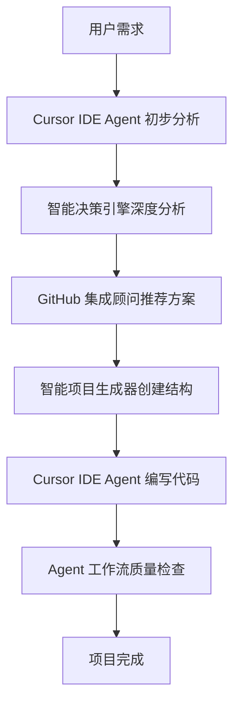

# Cursor IDE 官方 Agent 集成指南

本项目专为 **Cursor IDE 官方自带的 Agent 功能** 而设计，旨在增强和扩展 Cursor IDE 的原生 AI 能力。

## 🎯 与 Cursor IDE 的完美集成

### Cursor IDE Agent 功能概述

Cursor IDE 内置了强大的 AI Agent 功能，包括：

- **智能代码补全**: 基于上下文的代码建议
- **自然语言编程**: 通过对话生成代码
- **代码解释和重构**: AI 辅助代码理解和优化
- **问题诊断**: 智能错误检测和修复建议

### 本项目的增强价值

我们的系统在 Cursor IDE 原生功能基础上提供：

1. **战略级决策能力**
   - Cursor IDE: 代码级别的 AI 辅助
   - 我们的增强: 项目级别的战略规划和技术选型

2. **GitHub 生态集成**
   - Cursor IDE: 专注于代码生成
   - 我们的增强: 智能推荐和集成现有开源项目

3. **多角色协作**
   - Cursor IDE: 单一 AI 助手
   - 我们的增强: 10 个专业角色的完整开发团队

4. **全流程自动化**
   - Cursor IDE: 编码阶段辅助
   - 我们的增强: 从需求分析到部署的完整流程

## 🚀 在 Cursor IDE 中的使用方式

### 方式一: 直接在 Cursor IDE 中运行

```bash
# 在 Cursor IDE 终端中执行
make smart-dev

# 或者使用 Cursor 的 Agent 功能
# 在聊天界面输入: @agent 启动智能开发模式
```

### 方式二: 与 Cursor Agent 对话集成

在 Cursor IDE 的 Agent 聊天界面中，你可以：

```
用户: 我想创建一个电商网站
Cursor Agent: 我来帮你分析需求...

# 此时可以调用我们的增强系统
用户: 使用智能项目生成器分析这个需求
系统: 🔍 智能分析用户需求...
     📦 推荐集成方案: React + Ant Design + Node.js + Express...
     🎯 预计时间: 2-4 hours
```

### 方式三: 作为 Cursor IDE 的扩展工具

```bash
# 1. 需求分析阶段
make intelligent-agent
# 输出: 详细的技术方案和风险评估

# 2. 技术选型阶段
make github-advisor
# 输出: 推荐的开源项目和集成方案

# 3. 项目生成阶段
make smart-generate
# 输出: 完整的项目结构和代码

# 4. 在 Cursor IDE 中继续开发
# 使用 Cursor 的原生 Agent 功能进行具体的代码编写
```

## 🔄 工作流集成

### 标准开发流程



### 角色分工

| 阶段     | Cursor IDE Agent | 我们的增强系统           |
| -------- | ---------------- | ------------------------ |
| 需求理解 | 基础对话理解     | 深度需求分析和用户画像   |
| 技术选型 | 基础技术建议     | 智能推荐成熟开源方案     |
| 项目规划 | 简单结构建议     | 完整的项目架构和时间规划 |
| 代码生成 | ✅ 核心优势      | 模板和配置文件生成       |
| 代码优化 | ✅ 核心优势      | 质量检查和最佳实践       |
| 问题诊断 | ✅ 核心优势      | 系统性问题分析           |

## 🛠️ 技术集成细节

### 1. 命令行集成

在 Cursor IDE 终端中直接使用：

```bash
# 智能分析（输出 JSON 格式，便于 Cursor Agent 理解）
node scripts/intelligent-agent.js analyze "创建博客系统"

# GitHub 推荐（输出结构化建议）
node scripts/github-integration-advisor.js recommend "React UI 组件"

# 项目生成（创建完整项目结构）
node scripts/smart-project-generator.js generate "博客系统" "my-blog"
```

### 2. 配置文件集成

项目生成的配置文件完全兼容 Cursor IDE：

```json
// .vscode/settings.json (Cursor IDE 兼容)
{
  "cursor.ai.enabled": true,
  "cursor.ai.model": "claude-3.5-sonnet",
  "typescript.preferences.includePackageJsonAutoImports": "auto",
  "eslint.autoFixOnSave": true
}
```

### 3. 智能提示集成

生成的代码包含丰富的注释，便于 Cursor Agent 理解：

```typescript
/**
 * 用户认证服务
 *
 * @description 集成了 JWT 和 bcrypt，提供完整的用户认证功能
 * @integration 使用了 jsonwebtoken@9.0.0 和 bcryptjs@2.4.3
 * @cursor-hint 这个服务可以直接用于处理登录、注册、密码重置等功能
 */
export class AuthService {
  // Cursor Agent 可以基于这些注释提供更好的代码建议
}
```

## 🎨 用户体验优化

### 对话式交互

```
用户: 我想创建一个任务管理应用

Cursor Agent: 我来帮你创建任务管理应用...

智能系统: 🔍 检测到任务管理需求
         📊 推荐技术栈: React + Ant Design + Node.js + MongoDB
         ⏱️ 预计开发时间: 2-3 小时
         🎯 包含功能: 用户认证、任务CRUD、团队协作

         是否使用推荐方案？

用户: 是的

智能系统: 🚀 正在生成项目...
         ✅ 项目结构已创建
         📦 依赖已安装
         📚 文档已生成

         现在你可以在 Cursor IDE 中继续开发具体功能！

Cursor Agent: 项目已准备就绪！我可以帮你：
            - 实现用户登录功能
            - 创建任务管理界面
            - 添加数据库操作
            - 编写测试用例
```

### 智能建议

系统会根据项目类型和用户水平提供个性化建议：

```
🎯 为初学者用户:
- 提供详细的代码注释和解释
- 推荐学习资源和教程链接
- 简化技术栈选择
- 提供错误处理和调试指导

🎯 为经验用户:
- 推荐最新的最佳实践
- 提供高级配置选项
- 集成复杂的开发工具
- 优化性能和安全配置
```

## 📊 性能和监控

### 集成监控

```bash
# 查看 Agent 执行状态
make agent-manager status

# 查看工作流进度
make agent-workflow status

# 查看质量指标
make quality
```

### 性能优化

- **并行执行**: 多个 Agent 可以同时工作
- **智能缓存**: 避免重复分析相同需求
- **增量更新**: 只更新变化的部分
- **资源管理**: 智能分配计算资源

## 🔧 自定义和扩展

### 自定义 Agent 角色

```javascript
// .cursor/custom-agents/my-agent.js
module.exports = {
  name: 'my-custom-agent',
  role: '自定义专家',
  capabilities: ['特殊技能1', '特殊技能2'],
  workflow: {
    inputs: ['特定输入'],
    outputs: ['特定输出'],
    process: async input => {
      // 自定义处理逻辑
      return result;
    },
  },
};
```

### 集成第三方工具

```bash
# 集成 GitHub Copilot
make setup-copilot

# 集成 Tabnine
make setup-tabnine

# 集成自定义 AI 模型
make setup-custom-ai
```

## 🚀 未来规划

### 即将推出的 Cursor IDE 集成功能

1. **原生插件**: 开发 Cursor IDE 原生插件
2. **快捷命令**: 集成到 Cursor 的命令面板
3. **侧边栏面板**: 专用的 Agent 管理界面
4. **实时协作**: 多人同时使用 Agent 团队
5. **云端同步**: Agent 学习数据云端同步

### 长期愿景

打造 Cursor IDE 生态中最智能的 Agent 增强系统，让每个开发者都能拥有一支专业的 AI 开发团队。

## 💡 最佳实践

### 1. 与 Cursor Agent 配合使用

```
推荐工作流:
1. 使用我们的智能系统进行项目规划和技术选型
2. 使用 Cursor Agent 进行具体的代码编写
3. 使用我们的质量检查系统进行代码审查
4. 使用 Cursor Agent 进行代码优化和重构
```

### 2. 充分利用两者优势

```
我们的系统擅长:
- 项目级别的战略规划
- GitHub 生态的集成推荐
- 多角色协作和工作流管理
- 质量保证和最佳实践

Cursor Agent 擅长:
- 实时代码生成和补全
- 自然语言到代码的转换
- 代码解释和重构
- 实时问题诊断和修复
```

### 3. 学习和成长

```
对于初学者:
1. 先使用我们的系统了解项目全貌
2. 再使用 Cursor Agent 学习具体编码
3. 通过两者结合快速提升技能

对于专家:
1. 使用我们的系统快速搭建项目框架
2. 使用 Cursor Agent 专注于核心业务逻辑
3. 通过自动化提升开发效率
```

---

## 🎉 开始使用

现在就在你的 Cursor IDE 中体验这个强大的 Agent 增强系统：

```bash
# 克隆项目
git clone https://github.com/your-repo/cursor-agent-team.git

# 进入 Cursor IDE
cursor cursor-agent-team/

# 启动智能开发
make smart-dev
```

**记住我们的核心原则：优先使用现有轮子，除非造轮子更简单或更适合！** 🚀
