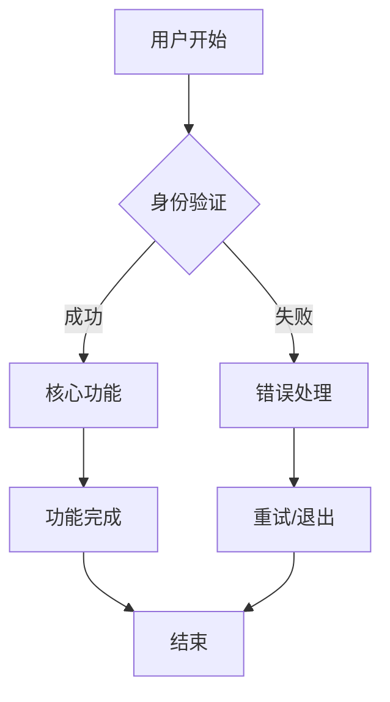

# 产品需求文档 (PRD)

**产品名称**: Cursor IDE 多角色 Agent 协作框架  
**版本**: v1.0.0  
**更新日期**: 2025-10-01  
**负责人**: Product Owner

---

## 1. 产品概述

### 1.1 产品愿景

打造一个**可复用的 Cursor
IDE 全栈自动化框架**，通过多角色 Agent 团队协作，规范化从需求分析到部署发布的全流程开发，让任何项目都能快速复制成功经验，实现**零学习成本的高质量交付**。

### 1.2 产品目标

**主要目标**:

- 建立标准化的多角色 Agent 协作体系（PO/PM/BA/PjM/Arch/LLME/Dev/QA/Ops/TW）
- 提供可复用的开发流程模板和最佳实践
- 实现智能化的需求分析和技术决策支持
- 确保代码质量和可维护性的自动化检查

**次要目标**:

- 降低编程门槛，支持小白用户快速上手
- 集成 GitHub 优质开源项目，避免重复造轮子
- 提供故障诊断和自动修复能力
- 建立可扩展的知识库和模板库

### 1.3 非目标 (Out of Scope)

- ❌ 不替代专业开发者的深度定制需求和架构决策
- ❌ 不支持非主流技术栈的复杂集成
- ❌ 不提供企业级的高级安全配置和审计
- ❌ 不包含复杂的微服务架构设计和分布式系统支持
- ❌ 不作为 Cursor IDE 的竞品，而是增强工具

## 2. 用户画像

### 2.1 主要用户：开发团队成员

**用户类型**: 使用 Cursor IDE 的全栈开发者、技术管理者

**特征**:

- 熟悉 AI 辅助编程工具
- 希望标准化团队开发流程
- 需要提高交付质量和效率
- 重视代码规范和最佳实践

**需求**:

- 清晰的角色分工和职责定义
- 标准化的工作流和交接规范
- 自动化的质量检查和测试
- 可复用的项目模板和最佳实践

### 2.2 次要用户：编程学习者

**用户类型**: 编程新手、自学者、转行开发者

**特征**:

- 对编程有兴趣但缺乏系统经验
- 不熟悉完整的开发流程
- 容易在技术细节上卡住
- 需要引导式学习路径

**需求**:

- 简单易懂的操作指引
- 完整的项目示例和文档
- 智能的错误诊断和修复建议
- 渐进式的学习路径

### 2.3 潜在用户：技术团队负责人

**用户类型**: 技术经理、项目经理、架构师

**特征**:

- 关注团队效率和交付质量
- 需要标准化开发流程
- 重视知识沉淀和传承
- 希望降低新人培训成本

**需求**:

- 完整的开发流程规范
- 质量度量和监控体系
- 团队协作工具和模板
- 可定制的工作流

## 3. 功能需求

### 3.1 MoSCoW 优先级

#### Must Have (必须有)

- {MUST_HAVE_1}
- {MUST_HAVE_2}
- {MUST_HAVE_3}

#### Should Have (应该有)

- {SHOULD_HAVE_1}
- {SHOULD_HAVE_2}

#### Could Have (可以有)

- {COULD_HAVE_1}
- {COULD_HAVE_2}

#### Won't Have (暂不实现)

- {WONT_HAVE_1}
- {WONT_HAVE_2}

### 3.2 主要业务流程



### 3.3 功能详细说明

#### 3.3.1 核心功能

**功能描述:** {CORE_FUNCTION_DESCRIPTION}

**用户场景:**

1. {USER_SCENARIO_1}
2. {USER_SCENARIO_2}
3. {USER_SCENARIO_3}

**验收标准:**

- [ ] {ACCEPTANCE_CRITERIA_1}
- [ ] {ACCEPTANCE_CRITERIA_2}
- [ ] {ACCEPTANCE_CRITERIA_3}

## 4. 接口与数据契约

### 4.1 API 接口设计

#### 4.1.1 用户认证

```
POST /api/auth/login
Request: { username: string, password: string }
Response: { token: string, user: UserInfo }
```

#### 4.1.2 核心功能接口

```
GET /api/{resource}
Response: { data: Array<Resource>, total: number }
```

### 4.2 数据模型

#### 4.2.1 用户模型

```typescript
interface User {
  id: string;
  username: string;
  email: string;
  createdAt: Date;
  updatedAt: Date;
}
```

#### 4.2.2 核心业务模型

```typescript
interface {CORE_ENTITY} {
  id: string;
  name: string;
  description?: string;
  status: 'active' | 'inactive';
  createdAt: Date;
  updatedAt: Date;
}
```

### 4.3 错误处理策略

#### 4.3.1 HTTP 状态码

- 200: 成功
- 400: 请求参数错误
- 401: 未授权
- 403: 禁止访问
- 404: 资源不存在
- 500: 服务器内部错误

#### 4.3.2 错误响应格式

```typescript
interface ErrorResponse {
  code: string;
  message: string;
  details?: any;
  timestamp: string;
}
```

#### 4.3.3 重试策略

- 网络错误：指数退避重试，最多 3 次
- 服务器错误：立即重试，最多 2 次
- 客户端错误：不重试

#### 4.3.4 超时设置

- API 调用：30 秒
- 数据库查询：10 秒
- 外部服务调用：60 秒

## 5. 非功能需求

### 5.1 性能要求

- 响应时间：< {RESPONSE_TIME}ms
- 并发用户：> {CONCURRENT_USERS}
- 吞吐量：> {THROUGHPUT} TPS

### 5.2 可用性要求

- 系统可用性：> {AVAILABILITY}%
- 故障恢复时间：< {RECOVERY_TIME}分钟

### 5.3 安全要求

- 数据加密：AES-256
- 传输安全：TLS 1.3
- 身份认证：JWT + OAuth 2.0

### 5.4 可观测性要求

- 监控指标：响应时间、错误率、吞吐量
- 日志级别：INFO、WARN、ERROR
- 告警阈值：错误率 > 5%

## 6. 验收标准矩阵

| 用户故事 | 测试用例 | 验收标准              | 负责人  | 状态   |
| -------- | -------- | --------------------- | ------- | ------ |
| US-001   | TC-001   | {ACCEPTANCE_CRITERIA} | {OWNER} | 待开发 |
| US-002   | TC-002   | {ACCEPTANCE_CRITERIA} | {OWNER} | 待开发 |
| US-003   | TC-003   | {ACCEPTANCE_CRITERIA} | {OWNER} | 待开发 |

## 7. 风险评估

### 7.1 技术风险

- **风险:** {TECHNICAL_RISK}
- **影响:** {IMPACT}
- **缓解措施:** {MITIGATION}

### 7.2 业务风险

- **风险:** {BUSINESS_RISK}
- **影响:** {IMPACT}
- **缓解措施:** {MITIGATION}

### 7.3 时间风险

- **风险:** {TIMELINE_RISK}
- **影响:** {IMPACT}
- **缓解措施:** {MITIGATION}

## 8. 发布计划

### 8.1 版本规划

- **v1.0 (MVP):** {MVP_FEATURES}
- **v1.1:** {V1_1_FEATURES}
- **v2.0:** {V2_0_FEATURES}

### 8.2 发布标准

- 所有 Must Have 功能完成
- 单元测试覆盖率 > 80%
- 集成测试通过
- 性能测试通过
- 安全扫描通过
