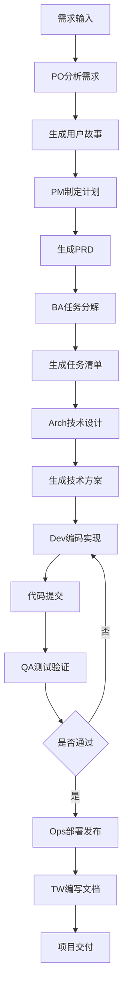
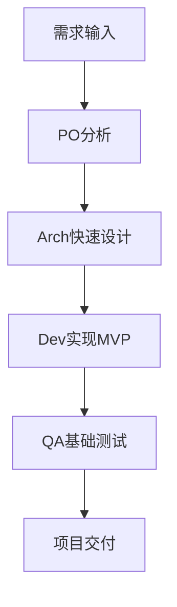
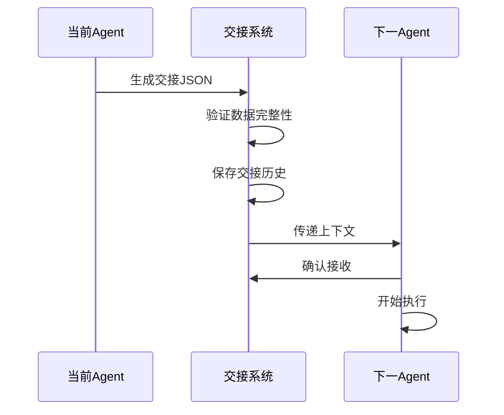

# 产品需求文档 (PRD)

**产品名称**: Cursor IDE 多角色 Agent 协作框架  
**版本**: v1.0.0  
**更新日期**: 2025-10-01  
**负责人**: Product Owner

---

## 执行摘要

本产品是一个**可复用的 Cursor
IDE 全栈自动化框架**，通过多角色 Agent 团队协作和标准化工作流，规范化从需求到部署的全流程开发。目标是让任何项目都能快速复制成功经验，实现高质量交付。

**核心价值**：

- 🎯 标准化的10个专业角色协作体系
- 📋 7个标准开发阶段和可复用模板
- 🤖 智能化的需求分析和技术决策支持
- ✅ 自动化的代码质量和测试保证

---

## 1. 产品概述

### 1.1 产品愿景

打造一个**可复用的 Cursor
IDE 全栈自动化框架**，通过多角色 Agent 团队协作，规范化从需求分析到部署发布的全流程开发，让任何项目都能快速复制成功经验，实现**零学习成本的高质量交付**。

### 1.2 产品目标

**主要目标**:

- 建立标准化的多角色 Agent 协作体系（PO/PM/BA/PjM/Arch/LLME/Dev/QA/Ops/TW）
- 提供可复用的开发流程模板和最佳实践
- 实现智能化的需求分析和技术决策支持
- 确保代码质量和可维护性的自动化检查

**次要目标**:

- 降低编程门槛，支持小白用户快速上手
- 集成 GitHub 优质开源项目，避免重复造轮子
- 提供故障诊断和自动修复能力
- 建立可扩展的知识库和模板库

### 1.3 非目标 (Out of Scope)

- ❌ 不替代专业开发者的深度定制需求和架构决策
- ❌ 不支持非主流技术栈的复杂集成
- ❌ 不提供企业级的高级安全配置和审计
- ❌ 不包含复杂的微服务架构设计和分布式系统支持
- ❌ 不作为 Cursor IDE 的竞品，而是增强工具

---

## 2. 用户画像

### 2.1 主要用户：开发团队成员

**用户类型**: 使用 Cursor IDE 的全栈开发者、技术管理者

**特征**:

- 熟悉 AI 辅助编程工具
- 希望标准化团队开发流程
- 需要提高交付质量和效率
- 重视代码规范和最佳实践

**需求**:

- 清晰的角色分工和职责定义
- 标准化的工作流和交接规范
- 自动化的质量检查和测试
- 可复用的项目模板和最佳实践

**痛点**:

- 不同项目开发流程不一致
- 质量标准执行不到位
- 知识和经验难以沉淀
- 新人培训成本高

### 2.2 次要用户：编程学习者

**用户类型**: 编程新手、自学者、转行开发者

**特征**:

- 对编程有兴趣但缺乏系统经验
- 不熟悉完整的开发流程
- 容易在技术细节上卡住
- 需要引导式学习路径

**需求**:

- 简单易懂的操作指引
- 完整的项目示例和文档
- 智能的错误诊断和修复建议
- 渐进式的学习路径

**痛点**:

- 不知道如何开始一个项目
- 缺乏系统的学习路径
- 遇到问题难以自行解决
- 代码质量难以保证

### 2.3 潜在用户：技术团队负责人

**用户类型**: 技术经理、项目经理、架构师

**特征**:

- 关注团队效率和交付质量
- 需要标准化开发流程
- 重视知识沉淀和传承
- 希望降低新人培训成本

**需求**:

- 完整的开发流程规范
- 质量度量和监控体系
- 团队协作工具和模板
- 可定制的工作流

**痛点**:

- 团队开发质量参差不齐
- 流程标准难以落地
- 项目交接成本高
- 难以复制成功经验

---

## 3. 功能需求

### 3.1 MoSCoW 优先级

#### Must Have (必须有) - MVP 核心功能

**FR-001: 多角色 Agent 体系**

- **描述**: 定义10个专业角色，每个角色有清晰的职责和产出物
- **角色列表**: PO/PM/BA/PjM/Arch/LLME/Dev/QA/Ops/TW
- **功能要点**:
  - 每个角色的职责、产出物、决策框架清晰定义
  - 角色切换命令（如 `/roles/po`）
  - 统一的提示词模板和行为准则
  - 角色协作矩阵和沟通规范
- **验收标准**:
  - [ ] 10个角色定义文档完整
  - [ ] 每个角色可通过命令激活
  - [ ] 角色产出物符合规范
  - [ ] 角色间交接顺畅
- **优先级**: P0 (最高)
- **工作量**: 已完成 80%

**FR-002: 标准化工作流**

- **描述**: 7个标准开发阶段，每个阶段有清晰的输入输出
- **阶段列表**: 用户故事→PRD→任务分解→技术设计→实现→测试→发布
- **功能要点**:
  - 每个阶段的输入、输出、验收标准
  - 阶段模板（`prompts/stages/`）
  - 工作流自动推进机制
  - 阶段检查点和质量门禁
- **验收标准**:
  - [ ] 7个阶段模板完整
  - [ ] 阶段间依赖关系清晰
  - [ ] 支持阶段跳过和回退
  - [ ] 阶段产出物可追溯
- **优先级**: P0 (最高)
- **工作量**: 已完成 90%

**FR-003: Agent 交接规范**

- **描述**: 统一的JSON Schema交接格式，确保上下文完整传递
- **功能要点**:
  - 统一的 JSON Schema 交接格式（`.cursor/rules/handover_schema.md`）
  - 交接数据验证和完整性检查
  - 上下文传递和状态管理
  - 交接历史记录和追溯
- **交接内容**:
  - 当前阶段和下一阶段
  - 输入数据和输出结果
  - 决策记录和依赖关系
  - 风险和建议
- **验收标准**:
  - [ ] 交接Schema定义完整
  - [ ] 支持自动验证
  - [ ] 交接历史可查询
  - [ ] 支持交接回滚
- **优先级**: P0 (最高)
- **工作量**: 已完成 70%

**FR-004: 质量保证体系**

- **描述**: 自动化的代码质量检查和测试保证
- **功能要点**:
  - 自动化 ESLint 代码检查
  - 单元测试和覆盖率要求（≥80%）
  - 文件结构和命名规范检查
  - Git 提交规范验证（Conventional Commits）
- **质量门禁**:
  - Lint 检查必须通过
  - 测试覆盖率≥80%
  - 无严重安全漏洞
  - 提交消息符合规范
- **验收标准**:
  - [ ] Makefile 包含所有质量命令
  - [ ] CI/CD 集成质量检查
  - [ ] 质量报告自动生成
  - [ ] 不达标时阻止合并
- **优先级**: P0 (最高)
- **工作量**: 已完成 60%

**FR-005: 项目文档框架**

- **描述**: 标准化的项目文档模板和自动化生成
- **文档类型**:
  - PROJECT_BRIEF: 项目概览和目标
  - USER_STORIES: 用户故事和验收标准
  - PRD: 产品需求文档
  - TASKS: 任务分解和优先级
  - TECH_DESIGN: 技术设计和架构
  - TEST_PLAN: 测试计划和用例
  - CHANGELOG: 变更记录
- **功能要点**:
  - 标准文档模板
  - 文档生成和更新自动化
  - 文档一致性检查
  - 版本控制和变更记录
- **验收标准**:
  - [ ] 所有文档模板完整
  - [ ] 支持一键生成文档骨架
  - [ ] 文档间引用自动更新
  - [ ] 文档变更可追溯
- **优先级**: P0 (最高)
- **工作量**: 已完成 85%

#### Should Have (应该有) - 增强功能

**FR-006: 智能化决策支持**

- **描述**: AI驱动的需求分析和技术决策支持
- **功能要点**:
  - 需求分析和项目类型识别（`intelligent-agent.js`）
  - 技术栈推荐算法
  - 风险识别和缓解建议
  - 复杂度评估和时间估算
- **智能特性**:
  - 用户水平识别（小白/初级/中级/高级）
  - 基于项目类型推荐技术栈
  - 风险评分和缓解方案
  - 学习成本评估
- **验收标准**:
  - [ ] 能识别常见项目类型
  - [ ] 推荐准确率≥80%
  - [ ] 风险识别覆盖主要场景
  - [ ] 时间估算误差≤30%
- **优先级**: P1
- **工作量**: 已完成 50%

**FR-007: GitHub 集成顾问**

- **描述**: 智能推荐GitHub开源项目，避免重复造轮子
- **功能要点**:
  - 开源项目推荐（`github-integration-advisor.js`）
  - 项目质量评分（星标、维护状态、文档质量）
  - 集成复杂度评估
  - 替代方案对比
- **推荐逻辑**:
  - 星标>10k + 活跃维护 + 良好文档 → 强烈推荐集成
  - 功能简单 + 自建更快 → 推荐自建
  - 多方案对比评分
- **验收标准**:
  - [ ] 能搜索相关GitHub项目
  - [ ] 质量评分算法合理
  - [ ] 推荐理由清晰
  - [ ] 集成时间估算准确
- **优先级**: P1
- **工作量**: 已完成 40%

**FR-008: 智能项目生成**

- **描述**: 基于需求自动生成项目结构和配置
- **功能要点**:
  - 项目模板库（`smart-project-generator.js`）
  - 基于需求的自动配置
  - 依赖管理和环境配置
  - README 和文档自动生成
- **项目模板**:
  - Web应用（React/Vue/Next.js）
  - API服务（Express/Koa/NestJS）
  - CLI工具（Node.js/TypeScript）
  - 库和组件（NPM包）
- **验收标准**:
  - [ ] 至少5个项目模板
  - [ ] 生成的项目可直接运行
  - [ ] README内容完整
  - [ ] 依赖自动安装
- **优先级**: P1
- **工作量**: 已完成 30%

**FR-009: 故障诊断工具**

- **描述**: Cursor IDE和项目的故障诊断和修复
- **功能要点**:
  - Cursor IDE 崩溃诊断（`diagnose-cursor-crash.sh`）
  - 常见问题自动修复（`fix-cursor-crash.sh`）
  - 性能优化建议（`optimize-cursor`）
  - 缓存清理工具
- **诊断场景**:
  - Cursor崩溃（crash code 5）
  - 性能卡顿
  - 内存占用过高
  - 插件冲突
- **验收标准**:
  - [ ] 能诊断主要问题
  - [ ] 提供修复方案
  - [ ] 一键修复常见问题
  - [ ] 修复成功率≥70%
- **优先级**: P1
- **工作量**: 已完成 70%

#### Could Have (可以有) - 未来增强

**FR-010: 高级 Agent 管理**

- **描述**: Agent执行监控和任务编排
- **功能要点**:
  - Agent 执行状态监控（`agent-manager.js`）
  - 任务分发和负载均衡
  - 会话管理和历史记录
  - 性能度量和优化
- **优先级**: P2
- **工作量**: 已完成 30%

**FR-011: 自定义工作流**

- **描述**: 支持用户自定义工作流模板
- **功能要点**:
  - 用户自定义工作流模板
  - 条件分支和并行任务
  - 工作流可视化编辑
  - 工作流市场和分享
- **优先级**: P2
- **工作量**: 未开始

**FR-012: 知识库系统**

- **描述**: 团队知识和经验沉淀
- **功能要点**:
  - 最佳实践知识库
  - 常见问题和解决方案
  - 技术选型决策树
  - 团队经验沉淀
- **优先级**: P2
- **工作量**: 未开始

#### Won't Have (暂不实现) - 明确排除

**FR-013: 完全自动化代码生成**

- **理由**: AI能力限制，质量难以保证，不符合"可复用框架"定位
- **替代方案**: 提供代码模板和最佳实践指导

**FR-014: 企业级高级功能**

- **包含**: 多租户、权限控制、审计日志、合规报告
- **理由**: 不是目标市场，增加复杂度，偏离核心价值
- **替代方案**: 提供标准化的单团队协作工具

**FR-015: 云平台深度集成**

- **包含**: 一键部署、Serverless、容器编排
- **理由**: 依赖外部服务，维护成本高，超出MVP范围
- **替代方案**: 提供部署文档和最佳实践

---

## 4. 业务流程

### 4.1 完整开发流程



### 4.2 快速原型流程



### 4.3 Agent交接流程



---

## 5. 非功能需求

### 5.1 性能要求

| 指标          | 目标值  | 说明               |
| ------------- | ------- | ------------------ |
| Agent响应时间 | ≤ 3秒   | 角色切换和命令执行 |
| 文档生成时间  | ≤ 10秒  | 标准文档模板生成   |
| 质量检查时间  | ≤ 30秒  | Lint + 测试        |
| 内存使用      | ≤ 500MB | 单个Agent运行时    |

### 5.2 可用性要求

| 指标       | 目标值    | 说明                 |
| ---------- | --------- | -------------------- |
| 学习时间   | ≤ 30分钟  | 新用户掌握基本操作   |
| 命令简洁度 | ≤ 5个字符 | 常用命令长度         |
| 错误恢复   | 100%      | 所有错误都有恢复方案 |
| 文档完整度 | ≥ 90%     | 每个功能都有文档     |

### 5.3 可维护性要求

- **代码覆盖率**: ≥ 80%
- **文档更新**: 与代码同步
- **技术债务**: 每月清理一次
- **依赖更新**: 每季度更新一次

### 5.4 兼容性要求

- **Cursor IDE**: 0.30+
- **Node.js**: 18.0+
- **操作系统**: macOS 10.15+ / Windows 10+ / Linux
- **终端**: Bash / Zsh / PowerShell

---

## 6. 数据模型

### 6.1 Agent 模型

```typescript
interface Agent {
  role: string; // 角色代码（po/pm/ba等）
  name: string; // 角色名称
  responsibilities: string[]; // 职责清单
  outputs: string[]; // 产出物类型
  prompts: string; // 提示词模板路径
  stage?: string; // 对应阶段
}
```

### 6.2 交接模型

```typescript
interface Handover {
  from_role: string; // 来源角色
  to_role: string; // 目标角色
  stage: string; // 当前阶段
  context: {
    // 上下文
    inputs: any; // 输入数据
    outputs: any; // 输出结果
    decisions: string[]; // 决策记录
  };
  metadata: {
    // 元数据
    timestamp: string;
    session_id: string;
    version: string;
  };
  next_actions: string[]; // 下一步行动
}
```

### 6.3 工作流模型

```typescript
interface Workflow {
  name: string;
  description: string;
  stages: WorkflowStage[];
  metadata: {
    created_at: string;
    updated_at: string;
    author: string;
  };
}

interface WorkflowStage {
  agent: string;
  stage: string;
  inputs: string[];
  outputs: string[];
  estimated_time: number; // 分钟
}
```

---

## 7. 验收标准

### 7.1 MVP 验收标准

| 功能项          | 验收标准               | 状态   |
| --------------- | ---------------------- | ------ |
| FR-001 角色体系 | 10个角色可用，切换正常 | ✅ 90% |
| FR-002 工作流   | 7个阶段模板完整        | ✅ 90% |
| FR-003 交接规范 | JSON Schema定义完整    | ⚠️ 70% |
| FR-004 质量体系 | Lint/Test自动化        | ⚠️ 60% |
| FR-005 文档框架 | 7类文档模板可用        | ✅ 85% |

### 7.2 质量标准

- **代码质量**: ESLint 0 error
- **测试覆盖**: ≥ 80%
- **文档完整**: 所有功能有文档
- **可运行性**: 新项目可一键启动

### 7.3 用户体验标准

- **易学性**: 30分钟掌握基本操作
- **易用性**: 常用功能≤3步完成
- **容错性**: 错误有清晰提示和恢复方案
- **一致性**: 命令和输出格式统一

---

## 8. 风险管理

### 8.1 技术风险

| 风险           | 影响 | 概率 | 缓解措施                     |
| -------------- | ---- | ---- | ---------------------------- |
| Cursor API变更 | 高   | 中   | 抽象API层，保持兼容性        |
| AI能力限制     | 中   | 高   | 降低自动化期望，提供人工介入 |
| 性能瓶颈       | 中   | 低   | 异步处理，缓存优化           |

### 8.2 业务风险

| 风险         | 影响 | 概率 | 缓解措施             |
| ------------ | ---- | ---- | -------------------- |
| 用户接受度低 | 高   | 中   | 充分的文档和示例     |
| 竞品压力     | 中   | 中   | 强调可复用框架特色   |
| 维护成本高   | 中   | 低   | 模块化设计，社区贡献 |

### 8.3 资源风险

| 风险         | 影响 | 概率 | 缓解措施            |
| ------------ | ---- | ---- | ------------------- |
| 开发时间不足 | 高   | 中   | MVP优先，分阶段交付 |
| 文档维护滞后 | 中   | 高   | 文档自动化生成      |
| 测试覆盖不足 | 高   | 中   | TDD开发，CI/CD集成  |

---

## 9. 发布计划

### 9.1 MVP 版本 (v1.0.0) - 当前目标

**时间**: 2025年10月 - 2025年11月 (4周)

**核心功能**:

- ✅ 10个角色定义（90%）
- ✅ 7个阶段模板（90%）
- ⚠️ Agent交接规范（70%）
- ⚠️ 质量保证体系（60%）
- ✅ 项目文档框架（85%）

**验收标准**:

- [ ] 所有Must Have功能可用
- [ ] 至少1个完整项目案例
- [ ] 文档完整且可执行
- [ ] 质量检查通过

**里程碑**:

1. Week 1-2: 完善FR-003交接规范和FR-004质量体系
2. Week 3: 集成测试和文档完善
3. Week 4: 案例验证和发布准备

### 9.2 增强版本 (v1.1.0) - 下一阶段

**时间**: 2025年12月 - 2026年1月 (6周)

**新增功能**:

- FR-006 智能化决策支持
- FR-007 GitHub集成顾问
- FR-008 智能项目生成
- FR-009 故障诊断工具

**验收标准**:

- 智能推荐准确率≥80%
- GitHub项目质量评分合理
- 项目模板≥5个
- 故障修复成功率≥70%

### 9.3 完整版本 (v2.0.0) - 长期规划

**时间**: 2026年2月 - 2026年4月 (8周)

**新增功能**:

- FR-010 高级Agent管理
- FR-011 自定义工作流
- FR-012 知识库系统
- 社区和生态建设

**验收标准**:

- 支持自定义工作流
- 知识库内容≥50条
- 社区贡献≥10人
- 用户满意度≥4.5/5

---

## 10. 成功度量

### 10.1 功能指标

- **角色使用率**: ≥ 80% 的角色被使用
- **工作流完整度**: ≥ 90% 的项目完成全流程
- **交接成功率**: ≥ 95% 的交接无误
- **质量通过率**: ≥ 90% 的提交通过质量检查

### 10.2 性能指标

- **响应时间**: P95 ≤ 3秒
- **生成时间**: 文档生成 ≤ 10秒
- **内存使用**: 平均 ≤ 300MB
- **错误率**: ≤ 5%

### 10.3 用户满意度

- **易学性评分**: ≥ 4.0/5
- **易用性评分**: ≥ 4.0/5
- **推荐意愿**: ≥ 70%
- **文档满意度**: ≥ 4.0/5

### 10.4 质量指标

- **代码覆盖率**: ≥ 80%
- **文档完整度**: ≥ 90%
- **Bug密度**: ≤ 5个/1000行
- **技术债务**: ≤ 10%

---

## 11. 附录

### 11.1 术语表

| 术语     | 说明                                             |
| -------- | ------------------------------------------------ |
| Agent    | AI驱动的自动化角色                               |
| Handover | Agent间的工作交接                                |
| Stage    | 开发阶段                                         |
| Workflow | 工作流                                           |
| MoSCoW   | 优先级方法（Must/Should/Could/Won't Have）       |
| RICE     | 评分方法（Reach × Impact × Confidence / Effort） |

### 11.2 参考文档

- [项目概览](PROJECT_BRIEF.md)
- [用户故事](USER_STORIES.md)
- [产品待办](PRODUCT_BACKLOG.md)
- [技术设计](TECH_DESIGN.md)
- [测试计划](TEST_PLAN.md)
- [智能系统指南](INTELLIGENT_SYSTEM_GUIDE.md)

### 11.3 变更历史

| 版本   | 日期       | 变更说明          | 负责人 |
| ------ | ---------- | ----------------- | ------ |
| v1.0.0 | 2025-10-01 | 初始版本，完整PRD | PO     |

---

**审批签字**:

- 产品负责人 (PO): **\*\*\*\***\_**\*\*\*\*** 日期: \***\*\_\*\***
- 项目经理 (PM): **\*\*\*\***\_**\*\*\*\*** 日期: \***\*\_\*\***
- 技术架构师 (Arch): **\*\*\*\***\_**\*\*\*\*** 日期: \***\*\_\*\***
