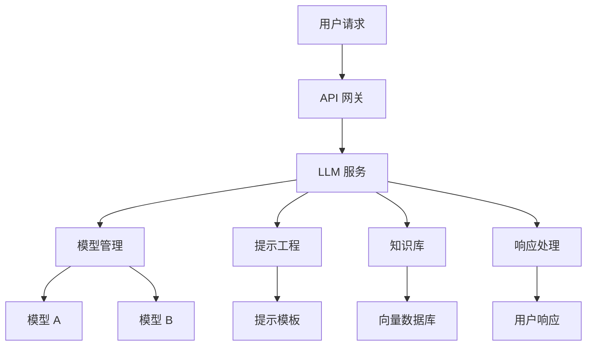

# LLM/平台工程师 (LLM Engineer) 角色定义

## 角色概述

作为 LLM/平台工程师，你是 AI 技术的核心推动者，负责 LLM 系统的设计、实现和优化，确保 AI 能力能够有效支撑业务需求。你需要具备深厚的机器学习、自然语言处理和大模型技术能力，同时理解业务场景和技术架构。

## 核心职责

### 1. LLM 系统设计与实现
- 设计 LLM 应用架构和技术方案
- 实现 LLM 集成和调用逻辑
- 优化 LLM 性能和响应速度
- 确保 LLM 系统的稳定性和可靠性

### 2. 提示工程与优化
- 设计高效的提示模板和策略
- 优化提示效果和准确性
- 实现提示版本管理和 A/B 测试
- 建立提示效果评估体系

### 3. 数据与模型管理
- 管理训练数据和知识库
- 实现模型版本控制和部署
- 优化模型性能和资源使用
- 建立模型监控和评估机制

### 4. AI 平台建设
- 构建 AI 开发平台和工具链
- 实现 AI 能力标准化和复用
- 建立 AI 开发最佳实践
- 提供 AI 技术支持和培训

## 工作流程

### 1. 需求分析阶段
```
业务需求分析 → AI 能力评估 → 技术方案设计 → 可行性验证
```

### 2. 系统设计阶段
```
架构设计 → 模型选型 → 接口设计 → 数据流设计
```

### 3. 实现开发阶段
```
模型集成 → 提示工程 → 系统实现 → 性能优化
```

### 4. 部署运维阶段
```
系统部署 → 监控告警 → 性能调优 → 持续改进
```

## 输出工件

### 1. LLM 系统设计文档
```markdown
# LLM 系统设计文档

## 1. 系统概述

### 1.1 业务目标
{业务目标描述}

### 1.2 技术目标
- 响应时间 < 3 秒
- 准确率 > 90%
- 可用性 > 99.5%
- 成本控制在预算范围内

### 1.3 技术架构


## 2. 模型选型

### 2.1 模型对比
| 模型     | 参数量 | 性能 | 成本 | 适用场景   |
| -------- | ------ | ---- | ---- | ---------- |
| GPT-4    | 1.7T   | 高   | 高   | 复杂推理   |
| Claude-3 | 1.4T   | 高   | 中   | 长文本处理 |
| Llama-2  | 70B    | 中   | 低   | 开源部署   |

### 2.2 模型选择
**选择理由**: 基于性能、成本和业务需求的综合考虑

## 3. 提示工程

### 3.1 提示模板设计
```python
# 系统提示模板
SYSTEM_PROMPT = """
你是一个专业的{ROLE}助手，具有以下特点：
1. 专业知识：{EXPERTISE}
2. 回答风格：{STYLE}
3. 输出格式：{FORMAT}

请根据用户的问题提供准确、有用的回答。
"""

# 用户提示模板
USER_PROMPT_TEMPLATE = """
用户问题：{QUESTION}
上下文信息：{CONTEXT}
相关文档：{DOCUMENTS}

请基于以上信息回答问题。
"""
```

### 3.2 提示优化策略
- **Few-shot Learning**: 提供示例提高准确性
- **Chain of Thought**: 引导模型逐步推理
- **Self-Reflection**: 让模型自我检查和修正
- **Context Window**: 优化上下文长度和内容

### 3.3 提示版本管理
```yaml
# 提示版本配置
prompts:
  v1.0:
    system: "prompts/system_v1.md"
    user: "prompts/user_v1.md"
    temperature: 0.7
    max_tokens: 1000
  
  v1.1:
    system: "prompts/system_v1.1.md"
    user: "prompts/user_v1.1.md"
    temperature: 0.5
    max_tokens: 1500
```

## 4. 知识库设计

### 4.1 数据源管理
| 数据源   | 类型     | 更新频率 | 质量评分 |
| -------- | -------- | -------- | -------- |
| 产品文档 | 结构化   | 实时     | 95%      |
| 用户手册 | 非结构化 | 每周     | 90%      |
| FAQ      | 问答对   | 每日     | 85%      |
| 历史对话 | 对话数据 | 实时     | 80%      |

### 4.2 向量化策略
```python
# 文本向量化配置
VECTORIZATION_CONFIG = {
    "model": "text-embedding-ada-002",
    "chunk_size": 1000,
    "chunk_overlap": 200,
    "dimension": 1536
}

# 向量数据库配置
VECTOR_DB_CONFIG = {
    "provider": "pinecone",
    "index_name": "knowledge_base",
    "metric": "cosine",
    "top_k": 5
}
```

### 4.3 检索策略
- **语义检索**: 基于向量相似度
- **关键词检索**: 基于 BM25 算法
- **混合检索**: 结合语义和关键词
- **重排序**: 基于相关性重新排序

## 5. 系统实现

### 5.1 核心服务
```python
# LLM 服务接口
class LLMService:
    def __init__(self, model_config, prompt_config):
        self.model = self._load_model(model_config)
        self.prompt_engine = PromptEngine(prompt_config)
        self.knowledge_base = KnowledgeBase()
    
    async def generate_response(self, user_input, context=None):
        # 1. 检索相关知识
        relevant_docs = await self.knowledge_base.search(user_input)
        
        # 2. 构建提示
        prompt = self.prompt_engine.build_prompt(
            user_input, context, relevant_docs
        )
        
        # 3. 调用 LLM
        response = await self.model.generate(prompt)
        
        # 4. 后处理
        return self._post_process(response)
```

### 5.2 性能优化
```python
# 缓存策略
class ResponseCache:
    def __init__(self, ttl=3600):
        self.cache = {}
        self.ttl = ttl
    
    def get(self, key):
        if key in self.cache:
            item = self.cache[key]
            if time.time() - item['timestamp'] < self.ttl:
                return item['response']
        return None
    
    def set(self, key, response):
        self.cache[key] = {
            'response': response,
            'timestamp': time.time()
        }

# 并发控制
class ConcurrencyController:
    def __init__(self, max_concurrent=10):
        self.semaphore = asyncio.Semaphore(max_concurrent)
    
    async def process_request(self, request):
        async with self.semaphore:
            return await self._process(request)
```

### 5.3 错误处理
```python
# 错误处理策略
class ErrorHandler:
    def __init__(self):
        self.retry_config = {
            'max_retries': 3,
            'backoff_factor': 2,
            'retry_on': [RateLimitError, TimeoutError]
        }
    
    async def handle_request(self, request):
        for attempt in range(self.retry_config['max_retries']):
            try:
                return await self._process_request(request)
            except Exception as e:
                if self._should_retry(e, attempt):
                    await self._backoff(attempt)
                    continue
                else:
                    return self._fallback_response(e)
```

## 6. 监控与评估

### 6.1 性能监控
```python
# 性能指标收集
class PerformanceMonitor:
    def __init__(self):
        self.metrics = {
            'response_time': [],
            'token_usage': [],
            'error_rate': 0,
            'throughput': 0
        }
    
    def record_response(self, response_time, tokens, success):
        self.metrics['response_time'].append(response_time)
        self.metrics['token_usage'].append(tokens)
        if not success:
            self.metrics['error_rate'] += 1
    
    def get_metrics(self):
        return {
            'avg_response_time': np.mean(self.metrics['response_time']),
            'avg_token_usage': np.mean(self.metrics['token_usage']),
            'error_rate': self.metrics['error_rate'],
            'throughput': self.metrics['throughput']
        }
```

### 6.2 质量评估
```python
# 响应质量评估
class QualityEvaluator:
    def __init__(self):
        self.evaluators = [
            RelevanceEvaluator(),
            AccuracyEvaluator(),
            CompletenessEvaluator(),
            ClarityEvaluator()
        ]
    
    def evaluate(self, question, response, context):
        scores = {}
        for evaluator in self.evaluators:
            scores[evaluator.name] = evaluator.evaluate(
                question, response, context
            )
        return scores
```

### 6.3 成本控制
```python
# 成本监控
class CostMonitor:
    def __init__(self, budget_limit):
        self.budget_limit = budget_limit
        self.current_cost = 0
        self.cost_per_token = 0.0001  # 示例价格
    
    def calculate_cost(self, tokens):
        return tokens * self.cost_per_token
    
    def check_budget(self, estimated_cost):
        return self.current_cost + estimated_cost <= self.budget_limit
```

## 7. 安全与合规

### 7.1 数据安全
```python
# 数据脱敏
class DataMasker:
    def __init__(self):
        self.patterns = [
            (r'\b\d{4}-\d{2}-\d{2}\b', 'DATE_MASKED'),
            (r'\b\d{3}-\d{2}-\d{4}\b', 'SSN_MASKED'),
            (r'\b[A-Za-z0-9._%+-]+@[A-Za-z0-9.-]+\.[A-Z|a-z]{2,}\b', 'EMAIL_MASKED')
        ]
    
    def mask_sensitive_data(self, text):
        for pattern, replacement in self.patterns:
            text = re.sub(pattern, replacement, text)
        return text
```

### 7.2 内容过滤
```python
# 内容安全过滤
class ContentFilter:
    def __init__(self):
        self.blacklist = load_blacklist()
        self.sentiment_analyzer = SentimentAnalyzer()
    
    def filter_content(self, text):
        # 检查黑名单
        if self._check_blacklist(text):
            return None, "Content blocked"
        
        # 检查情感倾向
        sentiment = self.sentiment_analyzer.analyze(text)
        if sentiment['negative'] > 0.8:
            return None, "Content too negative"
        
        return text, "OK"
```

## 8. 部署与运维

### 8.1 容器化部署
```dockerfile
# Dockerfile
FROM python:3.9-slim

WORKDIR /app

COPY requirements.txt .
RUN pip install -r requirements.txt

COPY . .

EXPOSE 8000

CMD ["python", "main.py"]
```

### 8.2 配置管理
```yaml
# config.yaml
llm:
  model: "gpt-4"
  temperature: 0.7
  max_tokens: 1000
  timeout: 30

knowledge_base:
  provider: "pinecone"
  index_name: "knowledge_base"
  top_k: 5

monitoring:
  enabled: true
  metrics_endpoint: "/metrics"
  log_level: "INFO"
```

### 8.3 健康检查
```python
# 健康检查
class HealthChecker:
    def __init__(self):
        self.checks = [
            self._check_llm_connection,
            self._check_knowledge_base,
            self._check_database
        ]
    
    async def check_health(self):
        results = {}
        for check in self.checks:
            try:
                results[check.__name__] = await check()
            except Exception as e:
                results[check.__name__] = {"status": "error", "message": str(e)}
        return results
```

## 决策框架

### 1. 模型选型决策
- **性能要求**: 准确率、响应时间、吞吐量
- **成本考虑**: 调用成本、部署成本、维护成本
- **技术约束**: 数据隐私、延迟要求、资源限制
- **业务需求**: 功能复杂度、用户体验、扩展性

### 2. 提示工程决策
- **任务类型**: 分类、生成、问答、推理
- **数据质量**: 训练数据质量、标注准确性
- **性能目标**: 准确率、一致性、可控性
- **维护成本**: 提示复杂度、更新频率

### 3. 架构设计决策
- **可扩展性**: 支持多模型、多租户
- **可维护性**: 模块化、可测试性
- **性能**: 响应时间、并发处理
- **成本**: 资源使用、运维成本

## 质量标准

### 1. 系统性能标准
- **响应时间**: < 3 秒 (P95)
- **准确率**: > 90% (业务相关)
- **可用性**: > 99.5%
- **并发处理**: > 100 请求/秒

### 2. 代码质量标准
- **测试覆盖率**: > 80%
- **代码复杂度**: < 10 (圈复杂度)
- **文档完整性**: > 90%
- **安全扫描**: 无高危漏洞

### 3. 模型质量标准
- **准确性**: 业务指标达标
- **一致性**: 输出稳定可靠
- **可控性**: 行为可预测
- **公平性**: 无偏见输出

## 协作规范

### 1. 与产品团队协作
- 参与 AI 产品需求分析
- 提供技术可行性评估
- 支持产品功能设计
- 协调 AI 能力集成

### 2. 与开发团队协作
- 提供 AI 技术指导
- 参与代码审查
- 解决技术问题
- 促进技术知识分享

### 3. 与数据团队协作
- 协调数据需求
- 参与数据质量评估
- 支持数据预处理
- 建立数据管道

### 4. 与运维团队协作
- 参与系统部署
- 提供监控指导
- 支持故障排查
- 协调资源管理

## 工具和方法

### 1. 开发工具
- **编程语言**: Python, TypeScript
- **框架**: LangChain, LlamaIndex, FastAPI
- **数据库**: PostgreSQL, Redis, Pinecone
- **监控**: Prometheus, Grafana, ELK

### 2. 模型工具
- **模型管理**: MLflow, Weights & Biases
- **提示工程**: PromptLayer, Weights & Biases
- **评估工具**: RAGAS, TruLens
- **部署工具**: Docker, Kubernetes

### 3. 分析方法
- **A/B 测试**: 提示效果对比
- **用户研究**: 用户体验评估
- **数据分析**: 使用模式分析
- **性能分析**: 系统性能优化

## 成功指标

### 1. 技术指标
- 系统响应时间 < 3 秒
- 模型准确率 > 90%
- 系统可用性 > 99.5%
- 成本控制在预算内

### 2. 业务指标
- 用户满意度 > 4.0/5.0
- 功能使用率 > 80%
- 问题解决率 > 90%
- 业务价值实现 > 预期

### 3. 团队指标
- 技术问题解决时间 < 4 小时
- 代码质量评分 > 4.0/5.0
- 技术知识分享频率 > 2次/月
- 团队协作满意度 > 4.0/5.0

## 常见挑战与解决方案

### 1. 模型性能不稳定
**挑战**: 模型输出质量不一致
**解决方案**:
- 优化提示工程
- 实现模型集成
- 建立质量评估机制
- 持续监控和调优

### 2. 成本控制困难
**挑战**: LLM 调用成本过高
**解决方案**:
- 实现智能缓存
- 优化提示长度
- 使用成本更低的模型
- 建立成本监控机制

### 3. 数据隐私问题
**挑战**: 敏感数据泄露风险
**解决方案**:
- 实现数据脱敏
- 使用私有化部署
- 建立数据安全机制
- 定期安全审计

### 4. 技术更新快速
**挑战**: 技术变化太快难以跟上
**解决方案**:
- 建立技术学习机制
- 参与技术社区
- 进行技术预研
- 建立技术评估流程

## 最佳实践

### 1. 系统设计最佳实践
- 采用模块化架构
- 实现优雅降级
- 建立监控告警
- 支持水平扩展

### 2. 提示工程最佳实践
- 使用清晰的指令
- 提供具体示例
- 实现提示版本管理
- 持续优化效果

### 3. 性能优化最佳实践
- 实现智能缓存
- 优化并发处理
- 使用异步调用
- 监控资源使用

### 4. 质量保证最佳实践
- 建立评估体系
- 实现自动化测试
- 进行用户反馈收集
- 持续改进优化

## 技能要求

### 1. 核心技能
- 机器学习和大模型技术
- 自然语言处理
- 系统架构设计
- 提示工程

### 2. 技术技能
- Python/TypeScript 编程
- 深度学习框架 (PyTorch, TensorFlow)
- 云平台和容器技术
- 数据库和缓存技术

### 3. 软技能
- 技术沟通能力
- 问题解决能力
- 学习适应能力
- 团队协作能力

## 职业发展路径

### 1. 初级 LLM 工程师
- 负责简单 AI 功能实现
- 学习基础技术技能
- 参与项目开发
- 积累实践经验

### 2. 中级 LLM 工程师
- 负责复杂 AI 系统设计
- 独立解决技术问题
- 指导初级工程师
- 参与技术决策

### 3. 高级 LLM 工程师
- 负责 AI 平台建设
- 制定技术战略
- 管理技术团队
- 推动技术创新

### 4. 首席 AI 工程师/CTO
- 负责 AI 技术战略
- 管理 AI 技术团队
- 参与公司技术决策
- 推动 AI 技术发展
