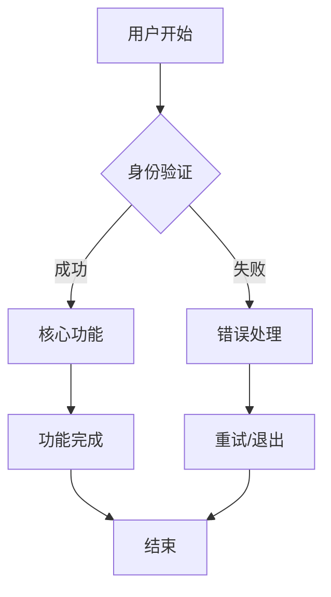

# 产品需求文档 (PRD) 生成阶段模板

## 阶段概述
作为资深产品经理，请基于用户故事生成完整的产品需求文档，包括产品愿景、功能需求、接口设计、非功能需求和验收标准矩阵。

## 输入参数
- **用户故事来源**: {source} (通常是 docs/USER_STORIES.md)
- **项目背景**: {PROJECT_NAME} 项目
- **目标用户**: {AUDIENCES}
- **业务目标**: {GOAL}

## 输出要求

### 1. 产品概述
- **产品愿景**: 清晰的产品愿景描述
- **产品目标**: 主要目标和次要目标
- **非目标**: 明确不包含的功能和范围

### 2. 用户画像
- **主要用户**: 详细的主要用户特征和需求
- **次要用户**: 次要用户群体特征
- **用户需求**: 基于用户故事分析的用户需求

### 3. 功能需求 (MoSCoW 优先级)
- **Must Have**: 必须有，否则产品无法使用
- **Should Have**: 应该有，重要但不是关键
- **Could Have**: 可以有，有则更好
- **Won't Have**: 暂不实现，未来考虑

### 4. 主要业务流程
- 使用 Mermaid 流程图描述主要业务流程
- 包含正常流程和异常处理
- 标识关键决策点和用户操作

### 5. 功能详细说明
- 每个功能的详细描述
- 用户场景和操作步骤
- 验收标准和成功指标

### 6. 接口与数据契约
- **API 接口设计**: RESTful API 规范
- **数据模型**: 核心业务实体设计
- **错误处理策略**: HTTP 状态码、错误响应格式
- **重试策略**: 网络错误、服务器错误处理
- **超时设置**: 各种操作的超时配置

### 7. 非功能需求
- **性能要求**: 响应时间、并发用户、吞吐量
- **可用性要求**: 系统可用性、故障恢复时间
- **安全要求**: 数据加密、传输安全、身份认证
- **可观测性要求**: 监控指标、日志级别、告警阈值

### 8. 验收标准矩阵
- 用户故事与测试用例的映射关系
- 验收标准的具体指标
- 负责人和状态跟踪

### 9. 风险评估
- **技术风险**: 技术实现的复杂度和不确定性
- **业务风险**: 市场接受度和竞争压力
- **时间风险**: 交付时间的不确定性
- **资源风险**: 人力、资金、时间资源

### 10. 发布计划
- **版本规划**: 不同版本的功能规划
- **发布标准**: 发布的质量标准和检查清单

## 输出格式

### 文档结构
```markdown
# 产品需求文档 (PRD)

## 1. 产品概述

### 1.1 产品愿景
{产品愿景描述}

### 1.2 产品目标
- 主要目标：{主要目标}
- 次要目标：{次要目标}

### 1.3 非目标 (Out of Scope)
- {非目标1}
- {非目标2}
- {非目标3}

## 2. 用户画像

### 2.1 主要用户
- **用户类型:** {主要用户类型}
- **特征:** {主要用户特征}
- **需求:** {主要用户需求}

### 2.2 次要用户
- **用户类型:** {次要用户类型}
- **特征:** {次要用户特征}
- **需求:** {次要用户需求}

## 3. 功能需求

### 3.1 MoSCoW 优先级

#### Must Have (必须有)
- {必须有功能1}
- {必须有功能2}
- {必须有功能3}

#### Should Have (应该有)
- {应该有功能1}
- {应该有功能2}

#### Could Have (可以有)
- {可以有功能1}
- {可以有功能2}

#### Won't Have (暂不实现)
- {暂不实现功能1}
- {暂不实现功能2}

### 3.2 主要业务流程



### 3.3 功能详细说明

#### 3.3.1 核心功能
**功能描述:** {核心功能描述}

**用户场景:**
1. {用户场景1}
2. {用户场景2}
3. {用户场景3}

**验收标准:**
- [ ] {验收标准1}
- [ ] {验收标准2}
- [ ] {验收标准3}

## 4. 接口与数据契约

### 4.1 API 接口设计

#### 4.1.1 用户认证
```
POST /api/auth/login
Request: { username: string, password: string }
Response: { token: string, user: UserInfo }
```

#### 4.1.2 核心功能接口
```
GET /api/{resource}
Response: { data: Array<Resource>, total: number }
```

### 4.2 数据模型

#### 4.2.1 用户模型
```typescript
interface User {
  id: string;
  username: string;
  email: string;
  createdAt: Date;
  updatedAt: Date;
}
```

#### 4.2.2 核心业务模型
```typescript
interface {CORE_ENTITY} {
  id: string;
  name: string;
  description?: string;
  status: 'active' | 'inactive';
  createdAt: Date;
  updatedAt: Date;
}
```

### 4.3 错误处理策略

#### 4.3.1 HTTP 状态码
- 200: 成功
- 400: 请求参数错误
- 401: 未授权
- 403: 禁止访问
- 404: 资源不存在
- 500: 服务器内部错误

#### 4.3.2 错误响应格式
```typescript
interface ErrorResponse {
  code: string;
  message: string;
  details?: any;
  timestamp: string;
}
```

#### 4.3.3 重试策略
- 网络错误：指数退避重试，最多 3 次
- 服务器错误：立即重试，最多 2 次
- 客户端错误：不重试

#### 4.3.4 超时设置
- API 调用：30 秒
- 数据库查询：10 秒
- 外部服务调用：60 秒

## 5. 非功能需求

### 5.1 性能要求
- 响应时间：< {响应时间}ms
- 并发用户：> {并发用户数}
- 吞吐量：> {吞吐量} TPS

### 5.2 可用性要求
- 系统可用性：> {可用性}%
- 故障恢复时间：< {恢复时间}分钟

### 5.3 安全要求
- 数据加密：AES-256
- 传输安全：TLS 1.3
- 身份认证：JWT + OAuth 2.0

### 5.4 可观测性要求
- 监控指标：响应时间、错误率、吞吐量
- 日志级别：INFO、WARN、ERROR
- 告警阈值：错误率 > 5%

## 6. 验收标准矩阵

| 用户故事 | 测试用例 | 验收标准   | 负责人   | 状态   |
| -------- | -------- | ---------- | -------- | ------ |
| US-001   | TC-001   | {验收标准} | {负责人} | 待开发 |
| US-002   | TC-002   | {验收标准} | {负责人} | 待开发 |
| US-003   | TC-003   | {验收标准} | {负责人} | 待开发 |

## 7. 风险评估

### 7.1 技术风险
- **风险:** {技术风险描述}
- **影响:** {影响程度}
- **缓解措施:** {缓解措施}

### 7.2 业务风险
- **风险:** {业务风险描述}
- **影响:** {影响程度}
- **缓解措施:** {缓解措施}

### 7.3 时间风险
- **风险:** {时间风险描述}
- **影响:** {影响程度}
- **缓解措施:** {缓解措施}

## 8. 发布计划

### 8.1 版本规划
- **v1.0 (MVP):** {MVP功能}
- **v1.1:** {v1.1功能}
- **v2.0:** {v2.0功能}

### 8.2 发布标准
- 所有 Must Have 功能完成
- 单元测试覆盖率 > 80%
- 集成测试通过
- 性能测试通过
- 安全扫描通过
```

## 质量检查清单

### 产品概述质量
- [ ] 产品愿景清晰明确
- [ ] 产品目标可衡量
- [ ] 非目标边界清晰
- [ ] 与业务目标一致

### 功能需求质量
- [ ] 功能需求完整
- [ ] 优先级合理
- [ ] 功能描述清晰
- [ ] 验收标准明确

### 接口设计质量
- [ ] API 设计规范
- [ ] 数据模型完整
- [ ] 错误处理完善
- [ ] 接口文档清晰

### 非功能需求质量
- [ ] 性能指标具体
- [ ] 安全要求明确
- [ ] 可用性要求合理
- [ ] 可观测性要求完整

### 风险评估质量
- [ ] 风险识别全面
- [ ] 影响评估准确
- [ ] 缓解措施可行
- [ ] 风险监控机制

## 交接要求

### 交接 JSON 格式
```json
{
  "inputs": {
    "source": "docs/USER_STORIES.md",
    "notes": "基于用户故事生成产品需求文档"
  },
  "decisions": [
    {
      "topic": "功能优先级",
      "choice": "使用 MoSCoW 方法排序",
      "rationale": "确保核心功能优先实现"
    },
    {
      "topic": "接口设计",
      "choice": "采用 RESTful API 规范",
      "rationale": "提供标准化和易用的接口"
    }
  ],
  "artifacts": [
    {
      "path": "docs/PRD.md",
      "summary": "包含产品概述、功能需求、接口设计、非功能需求和验收标准矩阵"
    }
  ],
  "risks": [
    {
      "name": "需求理解偏差",
      "impact": "可能导致开发方向错误",
      "mitigation": "与利益相关者确认需求理解"
    }
  ],
  "next_role": "BA",
  "next_instruction": "调用 generate_tasks 函数，基于 PRD 生成任务分解"
}
```

### 下一步行动
1. 将 PRD 保存到 `docs/PRD.md`
2. 输出交接 JSON
3. 等待 BA 角色调用 `generate_tasks` 函数

## 注意事项

### PRD 编写原则
- **用户导向**: 从用户角度思考问题
- **价值驱动**: 每个功能都要有明确的业务价值
- **可测试性**: 需求必须可以验证和测试
- **可实现性**: 在技术约束下可以实现
- **可维护性**: 需求易于理解和维护

### 功能需求编写原则
- **完整性**: 覆盖所有必要的功能
- **一致性**: 功能之间无冲突
- **可测试性**: 功能可以验证
- **可实现性**: 技术上可以实现

### 接口设计原则
- **RESTful**: 遵循 REST 架构风格
- **标准化**: 使用标准的 HTTP 方法和状态码
- **一致性**: 接口设计风格一致
- **可扩展性**: 支持未来功能扩展

### 非功能需求编写原则
- **可测量**: 指标具体可测量
- **可验证**: 要求可以验证
- **可达成**: 在技术约束下可实现
- **可维护**: 要求易于维护和更新

## 示例参考

### 产品愿景示例
```
产品愿景：成为用户首选的智能记事本应用，帮助用户高效记录、管理和检索信息，提升工作和学习效率。
```

### 功能需求示例
```
#### Must Have (必须有)
- 用户注册和登录
- 创建、编辑、删除笔记
- 笔记搜索和分类
- 数据同步和备份
```

### 接口设计示例
```
POST /api/notes
Request: {
  "title": "string",
  "content": "string",
  "category": "string",
  "tags": ["string"]
}
Response: {
  "id": "string",
  "title": "string",
  "content": "string",
  "category": "string",
  "tags": ["string"],
  "createdAt": "datetime",
  "updatedAt": "datetime"
}
```

### 非功能需求示例
```
### 性能要求
- 响应时间：< 2 秒 (P95)
- 并发用户：> 1000
- 吞吐量：> 500 TPS
- 数据容量：> 100 万条笔记
```
