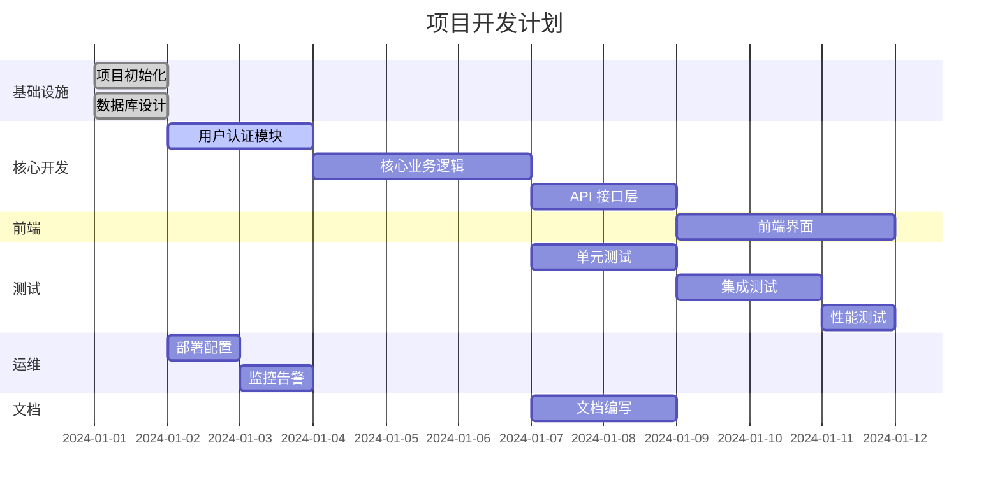
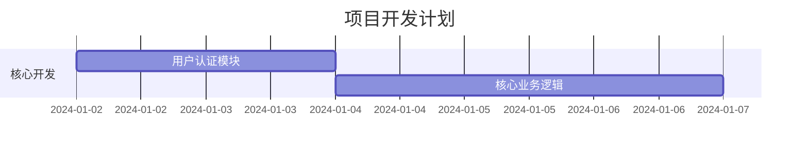

# 任务分解阶段模板

## 阶段概述
作为资深项目经理，请基于产品需求文档将项目分解为可执行的任务，包括任务规划、资源分配、时间估算和依赖关系管理。

## 输入参数
- **PRD 来源**: {source} (通常是 docs/PRD.md)
- **项目约束**: 时间、资源、技术约束
- **团队规模**: 可用的人力资源
- **技术栈**: 项目使用的技术栈

## 输出要求

### 1. 任务分解表
包含以下字段的任务列表：
- **任务ID**: 唯一标识符 (如 TB-001)
- **任务名称**: 清晰的任务描述
- **模块**: 所属功能模块
- **负责人**: 负责执行的角色
- **工时估算**: 预计完成时间 (小时)
- **依赖关系**: 前置任务依赖
- **优先级**: P0/P1/P2/P3
- **DoD**: 完成标准 (Definition of Done)
- **交付物路径**: 具体输出文件路径

### 2. 甘特图
使用 Mermaid 甘特图展示：
- 任务时间线
- 任务依赖关系
- 关键路径
- 里程碑节点

### 3. 燃尽图
展示项目进度跟踪：
- 剩余工时趋势
- 完成工时统计
- 累计完成率
- 预测完成时间

### 4. 关键路径分析
识别项目关键路径：
- 最长任务链
- 关键任务识别
- 风险任务标记
- 缓冲时间设置

### 5. 资源分配
- 角色工作量分配
- 资源冲突识别
- 资源优化建议
- 技能匹配分析

### 6. 风险任务识别
- 高风险任务标记
- 风险影响评估
- 缓解措施建议
- 应急预案制定

## 输出格式

### 文档结构
```markdown
# 任务分解

## 任务列表

| 任务ID | 任务名称     | 模块     | 负责人 | 工时(小时) | 依赖   | 优先级 | DoD               | 交付物路径                     |
| ------ | ------------ | -------- | ------ | ---------- | ------ | ------ | ----------------- | ------------------------------ |
| TB-001 | 项目初始化   | 基础设施 | DEV    | 4          | -      | P0     | 项目结构创建完成  | src/, tests/, docs/            |
| TB-002 | 用户认证模块 | 认证     | DEV    | 16         | TB-001 | P0     | 登录/注册功能可用 | src/auth/, tests/auth/         |
| TB-003 | 核心业务逻辑 | 业务     | DEV    | 24         | TB-002 | P0     | 主要功能实现      | src/business/, tests/business/ |
| TB-004 | API 接口层   | 接口     | DEV    | 12         | TB-003 | P0     | REST API 可用     | src/api/, tests/api/           |
| TB-005 | 数据库设计   | 数据     | ARCH   | 8          | -      | P0     | 数据模型定义      | docs/database/                 |
| TB-006 | 前端界面     | 界面     | DEV    | 20         | TB-004 | P1     | 用户界面可用      | src/frontend/, tests/frontend/ |
| TB-007 | 单元测试     | 测试     | QA     | 16         | TB-003 | P1     | 测试覆盖率>80%    | tests/unit/                    |
| TB-008 | 集成测试     | 测试     | QA     | 12         | TB-004 | P1     | 端到端测试通过    | tests/integration/             |
| TB-009 | 性能测试     | 测试     | QA     | 8          | TB-004 | P2     | 性能指标达标      | tests/performance/             |
| TB-010 | 部署配置     | 运维     | OPS    | 6          | TB-001 | P1     | 部署脚本可用      | deploy/, docker/               |
| TB-011 | 监控告警     | 运维     | OPS    | 8          | TB-010 | P2     | 监控系统就绪      | monitoring/                    |
| TB-012 | 文档编写     | 文档     | TW     | 10         | TB-003 | P2     | 用户文档完成      | docs/user/                     |

## 甘特图



## 燃尽图

| 日期       | 剩余工时 | 完成工时 | 累计完成率 |
| ---------- | -------- | -------- | ---------- |
| 2024-01-01 | 144      | 0        | 0%         |
| 2024-01-02 | 128      | 16       | 11%        |
| 2024-01-03 | 96       | 48       | 33%        |
| 2024-01-04 | 64       | 80       | 56%        |
| 2024-01-05 | 32       | 112      | 78%        |
| 2024-01-06 | 0        | 144      | 100%       |

## 关键路径

1. **TB-001** → **TB-002** → **TB-003** → **TB-004** → **TB-006**
2. **TB-005** → **TB-003** (并行)
3. **TB-007** → **TB-008** → **TB-009** (测试路径)

## 风险任务

| 任务ID | 风险描述                     | 影响    | 缓解措施                 |
| ------ | ---------------------------- | ------- | ------------------------ |
| TB-003 | 业务逻辑复杂度可能超预期     | 延期2天 | 提前技术预研，分解子任务 |
| TB-006 | 前端技术选型可能影响开发效率 | 延期1天 | 快速原型验证技术栈       |
| TB-008 | 集成测试环境搭建复杂         | 延期1天 | 提前准备测试环境         |

## 里程碑

- **M1 (2024-01-03):** 核心功能开发完成
- **M2 (2024-01-05):** 测试完成，功能稳定
- **M3 (2024-01-06):** 部署上线，项目交付

## 资源分配

| 角色 | 分配任务                               | 总工时 | 工作负载 |
| ---- | -------------------------------------- | ------ | -------- |
| DEV  | TB-001, TB-002, TB-003, TB-004, TB-006 | 76h    | 100%     |
| QA   | TB-007, TB-008, TB-009                 | 36h    | 100%     |
| OPS  | TB-010, TB-011                         | 14h    | 70%      |
| TW   | TB-012                                 | 10h    | 50%      |
| ARCH | TB-005                                 | 8h     | 40%      |

## 质量门禁

### 开发阶段
- [ ] 代码审查通过
- [ ] 单元测试覆盖率 > 80%
- [ ] 静态代码分析通过
- [ ] 安全扫描通过

### 测试阶段
- [ ] 所有测试用例通过
- [ ] 性能测试达标
- [ ] 兼容性测试通过
- [ ] 用户验收测试通过

### 发布阶段
- [ ] 部署脚本验证通过
- [ ] 监控系统就绪
- [ ] 回滚方案准备就绪
- [ ] 文档更新完成
```

## 质量检查清单

### 任务分解质量
- [ ] 任务粒度适中 (2-8小时)
- [ ] 任务描述清晰具体
- [ ] 任务相互独立
- [ ] 任务可分配给具体人员
- [ ] 任务有明确的交付物

### 时间估算质量
- [ ] 工时估算基于历史数据
- [ ] 考虑了任务复杂度
- [ ] 包含了缓冲时间
- [ ] 考虑了依赖关系
- [ ] 考虑了风险因素

### 依赖关系质量
- [ ] 依赖关系识别完整
- [ ] 依赖关系逻辑正确
- [ ] 避免了循环依赖
- [ ] 关键路径清晰
- [ ] 风险依赖已标记

### 资源分配质量
- [ ] 资源分配合理
- [ ] 技能匹配度高
- [ ] 工作量均衡
- [ ] 资源冲突已识别
- [ ] 备用方案已准备

## 交接要求

### 交接 JSON 格式
```json
{
  "inputs": {
    "source": "docs/PRD.md",
    "notes": "基于 PRD 生成详细的任务分解"
  },
  "decisions": [
    {
      "topic": "任务粒度",
      "choice": "2-8小时的任务粒度",
      "rationale": "便于跟踪和管理，避免任务过大或过小"
    },
    {
      "topic": "优先级排序",
      "choice": "基于业务价值和技术依赖排序",
      "rationale": "确保核心功能优先实现"
    }
  ],
  "artifacts": [
    {
      "path": "docs/TASKS.md",
      "summary": "包含任务列表、甘特图、燃尽图、关键路径分析和资源分配"
    }
  ],
  "risks": [
    {
      "name": "任务估算偏差",
      "impact": "可能导致项目延期",
      "mitigation": "定期回顾和调整估算，增加缓冲时间"
    }
  ],
  "next_role": "ARCH",
  "next_instruction": "调用 generate_tech_design 函数，基于任务分解生成技术设计"
}
```

### 下一步行动
1. 将任务分解保存到 `docs/TASKS.md`
2. 输出交接 JSON
3. 等待 ARCH 角色调用 `generate_tech_design` 函数

## 注意事项

### 任务分解原则
- **SMART 原则**: 任务具体、可测量、可达成、相关、有时限
- **独立性**: 任务之间相互独立
- **可测试性**: 任务完成标准可验证
- **可分配性**: 任务可以分配给具体人员

### 时间估算原则
- **基于历史数据**: 参考类似项目的经验
- **考虑复杂度**: 根据任务复杂度调整估算
- **包含缓冲时间**: 为不确定因素预留时间
- **定期调整**: 根据实际情况调整估算

### 依赖关系原则
- **最小依赖**: 尽量减少不必要的依赖
- **清晰标识**: 明确标识依赖关系
- **避免循环**: 避免循环依赖
- **关键路径**: 识别和管理关键路径

### 资源分配原则
- **技能匹配**: 根据技能分配任务
- **工作量均衡**: 避免工作量不均衡
- **风险分散**: 避免关键人员单点依赖
- **备用方案**: 准备资源冲突的解决方案

## 示例参考

### 任务分解示例
```
| TB-001 | 项目初始化 | 基础设施 | DEV | 4 | - | P0 | 项目结构创建完成 | src/, tests/, docs/ |
```

### 甘特图示例


### 关键路径示例
```
关键路径: TB-001 → TB-002 → TB-003 → TB-004 → TB-006
总工期: 4 + 16 + 24 + 12 + 20 = 76 小时
```

### 风险任务示例
```
| TB-003 | 业务逻辑复杂度可能超预期 | 延期2天 | 提前技术预研，分解子任务 |
```
