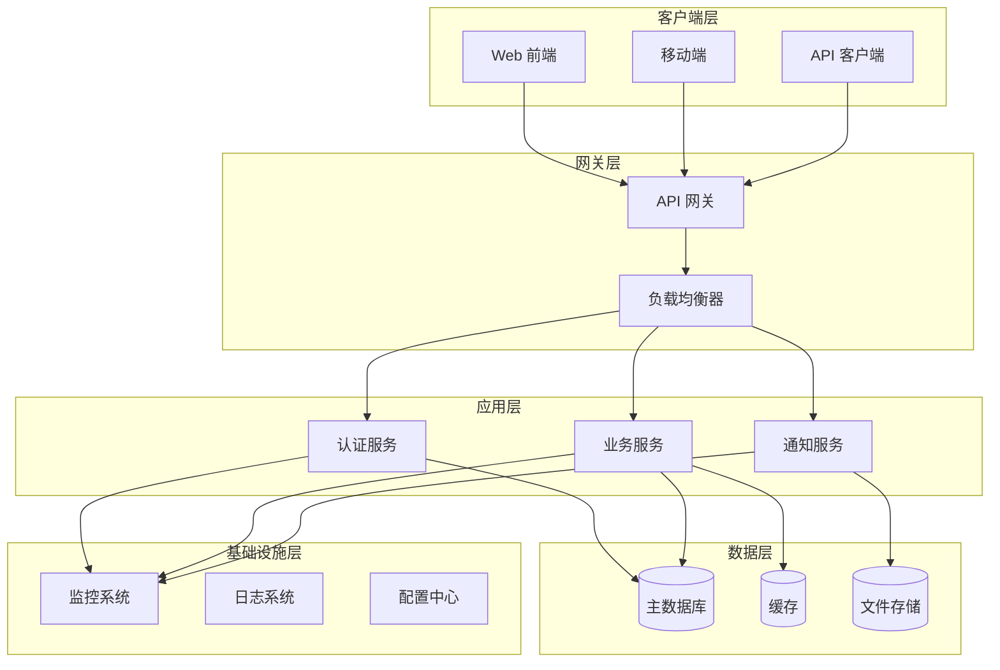
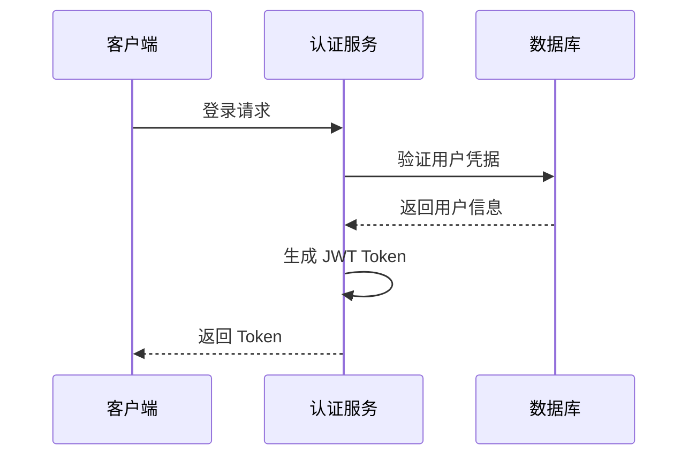
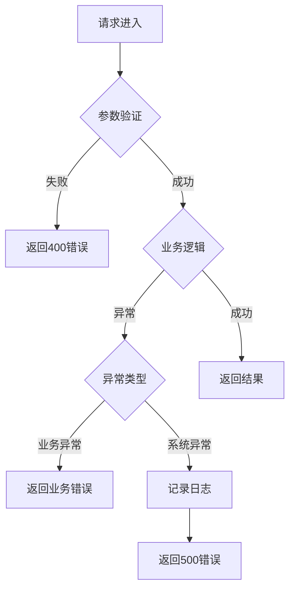

# 技术设计阶段模板

## 阶段概述
作为资深架构师，请基于任务分解和产品需求文档设计系统技术架构，包括系统架构、技术选型、模块设计、接口设计、数据模型、安全设计、性能优化和部署方案。

## 输入参数
- **任务分解来源**: {source} (通常是 docs/TASKS.md)
- **技术约束**: 现有技术栈、性能要求、安全要求
- **业务需求**: 功能需求、非功能需求
- **团队能力**: 团队技术能力和经验

## 输出要求

### 1. 系统架构设计
- **整体架构图**: 使用 Mermaid 或 ASCII 图展示系统架构
- **技术栈选择**: 各层级的技术选型和版本
- **架构原则**: 微服务、领域驱动、事件驱动等
- **部署架构**: 容器化、云原生部署方案

### 2. 模块设计
- **服务划分**: 按业务域划分的微服务
- **模块职责**: 每个模块的职责和边界
- **接口设计**: 模块间的接口定义
- **数据流设计**: 数据在系统中的流转

### 3. 数据模型设计
- **实体关系图**: 核心业务实体的关系
- **数据表设计**: 详细的数据库表结构
- **索引设计**: 性能优化的索引策略
- **数据迁移**: 数据迁移和版本管理

### 4. 接口设计
- **RESTful API**: 标准的 REST API 设计
- **数据格式**: 请求和响应的数据格式
- **错误处理**: 统一的错误处理机制
- **版本管理**: API 版本控制策略

### 5. 安全设计
- **认证授权**: JWT、OAuth 2.0 等认证方案
- **数据安全**: 数据加密和传输安全
- **访问控制**: 基于角色的访问控制
- **安全防护**: 输入验证、SQL 注入防护等

### 6. 性能优化
- **缓存策略**: 多级缓存架构
- **数据库优化**: 查询优化、索引优化
- **异步处理**: 消息队列、异步任务
- **CDN 加速**: 静态资源加速

### 7. 可观测性设计
- **监控指标**: 业务指标、技术指标
- **日志设计**: 结构化日志、日志级别
- **告警策略**: 告警规则和通知机制
- **链路追踪**: 分布式链路追踪

### 8. 部署运维
- **容器化**: Docker 容器化方案
- **编排**: Kubernetes 容器编排
- **CI/CD**: 持续集成和部署
- **监控运维**: 系统监控和运维

## 输出格式

### 文档结构
```markdown
# 技术设计文档

## 1. 系统架构

### 1.1 整体架构图



### 1.2 技术栈选择

| 层级     | 技术选型           | 版本 | 选择理由                    |
| -------- | ------------------ | ---- | --------------------------- |
| 前端     | React + TypeScript | 18.x | 生态成熟，类型安全          |
| 后端     | Node.js + Express  | 18.x | 开发效率高，JavaScript 全栈 |
| 数据库   | PostgreSQL         | 15.x | 关系型数据库，ACID 特性     |
| 缓存     | Redis              | 7.x  | 高性能内存数据库            |
| 消息队列 | RabbitMQ           | 3.x  | 可靠的消息传递              |
| 容器化   | Docker             | 24.x | 标准化部署                  |
| 编排     | Docker Compose     | 2.x  | 本地开发环境                |

## 2. 模块设计

### 2.1 认证模块

#### 2.1.1 职责
- 用户注册/登录
- JWT Token 管理
- 权限验证
- 密码加密

#### 2.1.2 接口设计
```typescript
interface AuthService {
  register(userData: RegisterRequest): Promise<AuthResponse>;
  login(credentials: LoginRequest): Promise<AuthResponse>;
  refreshToken(token: string): Promise<AuthResponse>;
  logout(token: string): Promise<void>;
  validateToken(token: string): Promise<UserInfo>;
}
```

#### 2.1.3 数据流


### 2.2 业务模块

#### 2.2.1 核心业务逻辑
- 业务规则验证
- 数据转换
- 业务事件处理

#### 2.2.2 服务接口
```typescript
interface BusinessService {
  createEntity(data: CreateRequest): Promise<Entity>;
  getEntity(id: string): Promise<Entity>;
  updateEntity(id: string, data: UpdateRequest): Promise<Entity>;
  deleteEntity(id: string): Promise<void>;
  listEntities(filters: FilterRequest): Promise<EntityList>;
}
```

### 2.3 数据访问层

#### 2.3.1 数据模型
```typescript
// 用户模型
interface User {
  id: string;
  username: string;
  email: string;
  passwordHash: string;
  createdAt: Date;
  updatedAt: Date;
}

// 业务实体模型
interface BusinessEntity {
  id: string;
  name: string;
  description?: string;
  status: 'active' | 'inactive';
  userId: string;
  createdAt: Date;
  updatedAt: Date;
}
```

#### 2.3.2 数据库设计
```sql
-- 用户表
CREATE TABLE users (
  id UUID PRIMARY KEY DEFAULT gen_random_uuid(),
  username VARCHAR(50) UNIQUE NOT NULL,
  email VARCHAR(100) UNIQUE NOT NULL,
  password_hash VARCHAR(255) NOT NULL,
  created_at TIMESTAMP DEFAULT CURRENT_TIMESTAMP,
  updated_at TIMESTAMP DEFAULT CURRENT_TIMESTAMP
);

-- 业务实体表
CREATE TABLE business_entities (
  id UUID PRIMARY KEY DEFAULT gen_random_uuid(),
  name VARCHAR(100) NOT NULL,
  description TEXT,
  status VARCHAR(20) DEFAULT 'active',
  user_id UUID REFERENCES users(id),
  created_at TIMESTAMP DEFAULT CURRENT_TIMESTAMP,
  updated_at TIMESTAMP DEFAULT CURRENT_TIMESTAMP
);
```

## 3. 接口设计

### 3.1 RESTful API 规范

#### 3.1.1 资源命名
- 使用复数名词：`/api/users`, `/api/entities`
- 使用小写字母和连字符：`/api/user-profiles`
- 避免动词：使用 HTTP 方法表示操作

#### 3.1.2 HTTP 方法映射
| 方法   | 用途     | 示例                     |
| ------ | -------- | ------------------------ |
| GET    | 获取资源 | `GET /api/users`         |
| POST   | 创建资源 | `POST /api/users`        |
| PUT    | 更新资源 | `PUT /api/users/{id}`    |
| PATCH  | 部分更新 | `PATCH /api/users/{id}`  |
| DELETE | 删除资源 | `DELETE /api/users/{id}` |

#### 3.1.3 响应格式
```typescript
interface ApiResponse<T> {
  success: boolean;
  data?: T;
  error?: {
    code: string;
    message: string;
    details?: any;
  };
  meta?: {
    total?: number;
    page?: number;
    limit?: number;
  };
}
```

### 3.2 错误处理

#### 3.2.1 错误码规范
```typescript
enum ErrorCode {
  // 客户端错误 (4xx)
  VALIDATION_ERROR = 'VALIDATION_ERROR',
  UNAUTHORIZED = 'UNAUTHORIZED',
  FORBIDDEN = 'FORBIDDEN',
  NOT_FOUND = 'NOT_FOUND',
  
  // 服务器错误 (5xx)
  INTERNAL_ERROR = 'INTERNAL_ERROR',
  SERVICE_UNAVAILABLE = 'SERVICE_UNAVAILABLE',
  DATABASE_ERROR = 'DATABASE_ERROR'
}
```

#### 3.2.2 错误处理策略
- 输入验证错误：返回 400 + 详细错误信息
- 认证失败：返回 401 + 认证错误信息
- 权限不足：返回 403 + 权限错误信息
- 资源不存在：返回 404 + 资源错误信息
- 服务器错误：返回 500 + 通用错误信息

## 4. 异常处理

### 4.1 异常分类

#### 4.1.1 业务异常
```typescript
class BusinessException extends Error {
  constructor(
    public code: string,
    message: string,
    public statusCode: number = 400
  ) {
    super(message);
  }
}
```

#### 4.1.2 系统异常
```typescript
class SystemException extends Error {
  constructor(
    public code: string,
    message: string,
    public statusCode: number = 500
  ) {
    super(message);
  }
}
```

### 4.2 异常处理流程



## 5. 幂等性设计

### 5.1 幂等性策略

#### 5.1.1 幂等键 (Idempotency Key)
```typescript
interface IdempotentRequest {
  idempotencyKey: string;
  // ... 其他请求参数
}
```

#### 5.1.2 幂等性实现
```typescript
class IdempotencyService {
  async executeWithIdempotency<T>(
    key: string,
    operation: () => Promise<T>
  ): Promise<T> {
    // 检查是否已执行
    const cached = await this.cache.get(key);
    if (cached) {
      return cached;
    }
    
    // 执行操作
    const result = await operation();
    
    // 缓存结果
    await this.cache.set(key, result, 3600); // 1小时过期
    
    return result;
  }
}
```

### 5.2 重试机制

#### 5.2.1 指数退避算法
```typescript
class RetryService {
  async retryWithBackoff<T>(
    operation: () => Promise<T>,
    maxRetries: number = 3
  ): Promise<T> {
    for (let attempt = 0; attempt <= maxRetries; attempt++) {
      try {
        return await operation();
      } catch (error) {
        if (attempt === maxRetries) {
          throw error;
        }
        
        // 指数退避：1s, 2s, 4s
        const delay = Math.pow(2, attempt) * 1000;
        await this.sleep(delay);
      }
    }
  }
}
```

## 6. 可测试性设计

### 6.1 依赖注入

```typescript
interface Dependencies {
  userRepository: UserRepository;
  authService: AuthService;
  logger: Logger;
}

class BusinessService {
  constructor(private deps: Dependencies) {}
  
  async createUser(userData: CreateUserRequest): Promise<User> {
    // 使用注入的依赖
    const hashedPassword = await this.deps.authService.hashPassword(userData.password);
    return await this.deps.userRepository.create({
      ...userData,
      password: hashedPassword
    });
  }
}
```

### 6.2 测试策略

#### 6.2.1 单元测试
- 测试覆盖率目标：> 80%
- 使用 Jest + Supertest
- Mock 外部依赖

#### 6.2.2 集成测试
- 测试 API 端点
- 使用测试数据库
- 验证数据一致性

#### 6.2.3 端到端测试
- 使用 Playwright
- 测试完整用户流程
- 验证前端-后端集成

## 7. 可观测性设计

### 7.1 日志设计

#### 7.1.1 日志级别
- **ERROR**: 系统错误，需要立即处理
- **WARN**: 警告信息，需要关注
- **INFO**: 一般信息，记录重要操作
- **DEBUG**: 调试信息，开发时使用

#### 7.1.2 日志格式
```json
{
  "timestamp": "2024-01-01T00:00:00.000Z",
  "level": "INFO",
  "service": "auth-service",
  "traceId": "abc123",
  "userId": "user-123",
  "message": "User login successful",
  "metadata": {
    "ip": "192.168.1.1",
    "userAgent": "Mozilla/5.0..."
  }
}
```

### 7.2 监控指标

#### 7.2.1 业务指标
- 用户注册数
- 登录成功率
- API 调用次数
- 错误率

#### 7.2.2 技术指标
- 响应时间 (P50, P95, P99)
- 吞吐量 (RPS)
- 内存使用率
- CPU 使用率

### 7.3 告警策略

| 指标       | 阈值    | 告警级别 | 处理时间 |
| ---------- | ------- | -------- | -------- |
| 错误率     | > 5%    | P1       | 15分钟   |
| 响应时间   | > 2s    | P2       | 30分钟   |
| 内存使用率 | > 80%   | P2       | 30分钟   |
| 服务不可用 | > 1分钟 | P0       | 5分钟    |

## 8. 替代方案与权衡

### 8.1 技术选型权衡

#### 8.1.1 数据库选择
| 方案       | 优点                 | 缺点         | 适用场景   |
| ---------- | -------------------- | ------------ | ---------- |
| PostgreSQL | ACID、功能丰富       | 复杂查询性能 | 关系型数据 |
| MongoDB    | 灵活模式、水平扩展   | 无 ACID      | 文档存储   |
| Redis      | 高性能、丰富数据结构 | 内存限制     | 缓存、会话 |

#### 8.1.2 缓存策略
| 方案       | 优点           | 缺点             | 适用场景 |
| ---------- | -------------- | ---------------- | -------- |
| 本地缓存   | 延迟低         | 内存限制、一致性 | 读多写少 |
| 分布式缓存 | 容量大、一致性 | 网络延迟         | 高并发   |
| CDN        | 全球分布       | 成本高           | 静态资源 |

### 8.2 架构演进路径

#### 8.2.1 单体架构 → 微服务
- **当前**: 单体应用
- **演进**: 按业务域拆分服务
- **时机**: 团队规模 > 10人，业务复杂度高

#### 8.2.2 同步 → 异步
- **当前**: 同步 API 调用
- **演进**: 引入消息队列
- **时机**: 性能瓶颈，解耦需求

## 9. 安全设计

### 9.1 认证与授权

#### 9.1.1 JWT Token 设计
```typescript
interface JWTPayload {
  sub: string;        // 用户ID
  iat: number;        // 签发时间
  exp: number;        // 过期时间
  roles: string[];    // 用户角色
  permissions: string[]; // 权限列表
}
```

#### 9.1.2 权限控制
```typescript
enum Permission {
  USER_READ = 'user:read',
  USER_WRITE = 'user:write',
  ADMIN_READ = 'admin:read',
  ADMIN_WRITE = 'admin:write'
}

class PermissionService {
  hasPermission(user: User, permission: Permission): boolean {
    return user.permissions.includes(permission);
  }
}
```

### 9.2 数据安全

#### 9.2.1 数据加密
- 传输加密：TLS 1.3
- 存储加密：AES-256
- 密码哈希：bcrypt (cost=12)

#### 9.2.2 敏感数据处理
```typescript
class SensitiveDataService {
  encrypt(data: string): string {
    // 使用 AES-256 加密
    return this.crypto.encrypt(data, this.encryptionKey);
  }
  
  decrypt(encryptedData: string): string {
    return this.crypto.decrypt(encryptedData, this.encryptionKey);
  }
}
```

## 10. 性能优化

### 10.1 数据库优化

#### 10.1.1 索引设计
```sql
-- 用户表索引
CREATE INDEX idx_users_email ON users(email);
CREATE INDEX idx_users_username ON users(username);

-- 业务实体表索引
CREATE INDEX idx_entities_user_id ON business_entities(user_id);
CREATE INDEX idx_entities_status ON business_entities(status);
CREATE INDEX idx_entities_created_at ON business_entities(created_at);
```

#### 10.1.2 查询优化
- 使用 EXPLAIN 分析查询计划
- 避免 N+1 查询问题
- 合理使用分页

### 10.2 缓存策略

#### 10.2.1 缓存层级
1. **L1 缓存**: 应用内存缓存 (1分钟)
2. **L2 缓存**: Redis 缓存 (10分钟)
3. **L3 缓存**: 数据库查询缓存 (1小时)

#### 10.2.2 缓存更新策略
- **Cache-Aside**: 应用控制缓存
- **Write-Through**: 同时更新缓存和数据库
- **Write-Behind**: 异步更新数据库
```

## 质量检查清单

### 架构设计质量
- [ ] 架构图清晰完整
- [ ] 技术选型合理
- [ ] 模块职责清晰
- [ ] 接口设计规范

### 数据设计质量
- [ ] 数据模型完整
- [ ] 索引设计合理
- [ ] 数据关系正确
- [ ] 性能考虑充分

### 安全设计质量
- [ ] 认证授权完善
- [ ] 数据安全保护
- [ ] 输入验证充分
- [ ] 安全防护到位

### 性能设计质量
- [ ] 性能指标明确
- [ ] 缓存策略合理
- [ ] 数据库优化充分
- [ ] 监控告警完善

## 交接要求

### 交接 JSON 格式
```json
{
  "inputs": {
    "source": "docs/TASKS.md",
    "notes": "基于任务分解生成技术设计"
  },
  "decisions": [
    {
      "topic": "架构模式",
      "choice": "微服务架构",
      "rationale": "支持业务增长和团队扩展"
    },
    {
      "topic": "技术选型",
      "choice": "Node.js + PostgreSQL + Redis",
      "rationale": "团队熟悉度高，生态成熟"
    }
  ],
  "artifacts": [
    {
      "path": "docs/TECH_DESIGN.md",
      "summary": "包含系统架构、模块设计、接口设计、数据模型、安全设计和性能优化"
    }
  ],
  "risks": [
    {
      "name": "技术复杂度",
      "impact": "可能影响开发进度",
      "mitigation": "提供技术培训和指导"
    }
  ],
  "next_role": "DEV",
  "next_instruction": "调用 generate_implementation 函数，基于技术设计进行实现"
}
```

### 下一步行动
1. 将技术设计保存到 `docs/TECH_DESIGN.md`
2. 输出交接 JSON
3. 等待 DEV 角色调用 `generate_implementation` 函数

## 注意事项

### 架构设计原则
- **可扩展性**: 支持业务增长
- **可维护性**: 易于理解和修改
- **可测试性**: 易于测试验证
- **可观测性**: 易于监控和调试

### 技术选型原则
- **成熟度**: 技术成熟稳定
- **团队能力**: 团队技术能力匹配
- **生态支持**: 社区活跃度
- **长期维护**: 技术可持续性

### 安全设计原则
- **最小权限**: 最小必要权限
- **深度防御**: 多层安全防护
- **安全默认**: 默认安全配置
- **持续监控**: 持续安全监控

### 性能设计原则
- **性能预算**: 设定性能目标
- **缓存优先**: 合理使用缓存
- **异步处理**: 异步处理耗时操作
- **监控告警**: 实时性能监控
